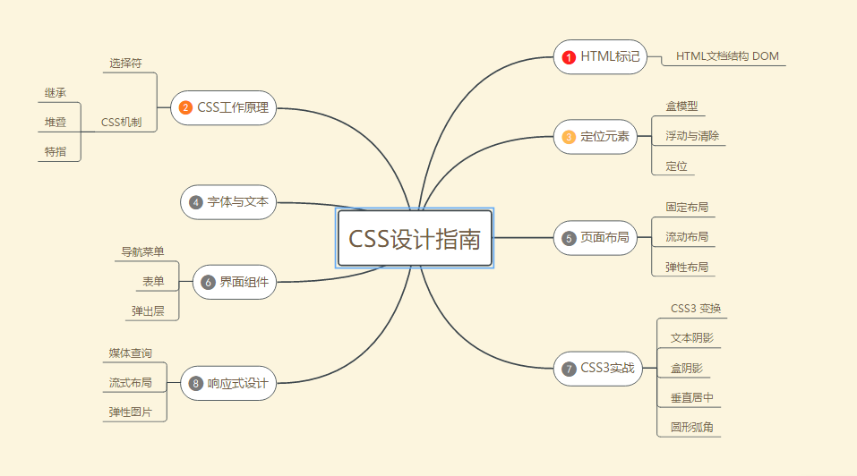
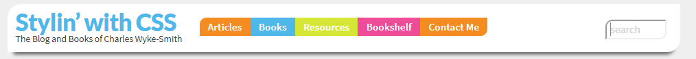

<!-- TOC -->

- [HTML 标记与文档结构](#html-标记与文档结构)
    - [Web Developer浏览器插件的使用](#web-developer浏览器插件的使用)
    - [文档对象模型](#文档对象模型)
- [CSS 工作原理](#css-工作原理)
    - [**上下文选择符**](#上下文选择符)
    - [**ID和类选择符**](#id和类选择符)
    - [**属性选择符**](#属性选择符)
    - [**CSS 机制**](#css-机制)
        - [继承](#继承)
        - [层叠](#层叠)
        - [特指](#特指)
    - [**规则声明**](#规则声明)
- [定位元素](#定位元素)
    - [**盒模型**](#盒模型)
    - [**盒子属性**](#盒子属性)
    - [**叠加外边距**](#叠加外边距)
    - [**盒模型宽度计算**](#盒模型宽度计算)
    - [**浮动和清除**](#浮动和清除)
    - [**定位**](#定位)
        - [定位上下文](#定位上下文)
    - [**显示属性**](#显示属性)
    - [**背景**](#背景)
    - [**背景渐变**](#背景渐变)
- [字体和文本](#字体和文本)
- [页面布局](#页面布局)
    - [单栏-固定宽度布局](#单栏-固定宽度布局)
    - [二栏-固定宽度布局](#二栏-固定宽度布局)
    - [三栏-固定宽度布局](#三栏-固定宽度布局)
    - [为栏设定内边距和边框](#为栏设定内边距和边框)
    - [三栏-中栏流动布局](#三栏-中栏流动布局)
        - [用负边距实现](#用负边距实现)
        - [用 CSS3 单元格实现](#用-css3-单元格实现)
- [界面组件](#界面组件)
    - [**导航菜单**](#导航菜单)
    - [**表单**](#表单)
        - [基本标记和控件](#基本标记和控件)
    - [**CSS3 过渡**](#css3-过渡)
    - [**弹出层**](#弹出层)
- [CSS3 实战](#css3-实战)
    - [CSS3 变换](#css3-变换)
- [响应式设计](#响应式设计)
    - [媒体查询](#媒体查询)
        - [`@media`规则](#media规则)
        - [`<link>`标签的 media 属性](#link标签的-media-属性)
        - [用 `<meta>` 标签设定视口](#用-meta-标签设定视口)
    - [流动布局](#流动布局)

<!-- /TOC -->

## HTML 标记与文档结构

> HTML 标记内容的目的是为了赋予网页语义(semantic)。

如果标签包含内容是文本，则使用闭合标签,如果不是,则使用非闭合标签.闭合标签会显示显示内容，自闭标签只是给浏览器提供一个对要显示内容的引用。
```html
<!-- 闭合标签 -->
<标签名>文本内容</标签名>
<!-- 自闭标签 -->
 
```

块级标签
- `<h1>-<h6>`: 标题
- `<p>`: 段落
- `<ol>`: 有序列表
- `<li>`: 列表项
- `<blockquote>`: 独立引用
- `<div>`

行内标签
- `<a>`: 链接
- ``: 图片
- `<em>`: 斜体
- `<strong>`: 重要
- `<abbr>`: 简写
- `<cite>`: 引用
- `<q>`: 文本内引用

HTML 模板
```html
<!DOCTYPE html>
<html>
    <head>
        <meta charset="utf-8">
        <title>An HTML Template</title>
    </head>
    <body>
        <!-- 这里是页面内容 -->
    </body>
</html>
```
搜索引擎会给`<title>`标签中的内容赋予很高的权重。

文档流：HTML 元素会按照它们各自在标记中出现的先后顺序，依次从页面上方“流向”下方。块级元素会相互堆叠在一起沿页面向下排列，每个元素各占一行。行内元素会相互并列，只有空间不足才会折到下一行显示。

### Web Developer浏览器插件的使用
- Outline Block Level Elements: 显示块级元素轮廓
- Outline Custom Elements: 显示自定义元素的轮廓

> HTML 实体：用于生成那些键盘上没有的印刷字体。以一个和号(&)开头，一个分号(;)结尾，二者之间表示实体的字符串。

### 文档对象模型
DOM 是从浏览器的视角来观察页面中的元素以及元素的属性，由此得到这些元素的一个家族树。通过DOM，可以确定元素之间的相互关系。
```html
<body>
    <section>
        <h1>The Document Object Model</h1>
        <p>The page's HTML markup structure defines the DOM</p>
    </section>
</body>
```
DOM的结构为：
```
    body
     |
    section
    /  \
   h1   p
```
section是h1和p的父元素，也是直接祖先元素。h1和p是同胞元素，是section的直接后代元素。

## CSS 工作原理
为文档添加样式的三种方法
- 行内样式：写在特定 HTML 标签的 style 属性里
- 嵌入样式: 写在 HTML 文档的 head 元素的 style 标签中
- 链接样式: 使用 link 标签把样式表链接到每个页面
- `@import`指令: 在样式表中链接其他样式表的方法

CSS 样式通过`<style>`标签嵌入到页面里的，当浏览器遇到标签`<style>`时，就由解释 HTML 代码切换到解释 CSS 代码,等遇到`</style>`闭标签，再切回解释 HTML 代码。

CSS 规则：声明了要修改的元素和元素的样式。
```css
p {color: red;}
```
CSS 规则由选择符和声明两部分组成，选择符指出规则所要选择的元素，声明分为属性和值.
```css
选择符 {属性: 值;}
```
选择特定元素的选择符分三种:
### **上下文选择符**
也叫后代组合式选择符，只有是标签1的后代标签2才应用样式，以空格作为分隔符
```css
标签1 标签2 {声明}
```
**子选择符`>`**：标签2必须是标签1的子元素。
```css
标签1>标签2 {声明}
```
**紧邻同胞选择符`+`**: 标签2必须紧跟同胞标签1的后面
```css
标签1+标签2 {声明}
```
**一般同胞选择符`~`**: 标签2必须跟(不一定紧跟)在其同胞标签1后面。
```css
标签1~标签2 {声明}
```
**通配选择符`*`**: 匹配任何元素
```cs
* {声明}
// 任何是section的孙子元素，而非子元素的a标签会被选中
slection * a {声明}
```
### **ID和类选择符**
- 类选择符： `.类名 {声明}`
- 标签带类选择符： `标签.类名 {声明}`
- 多类选择符： `.类名1.类名2 {声明}`
- ID选择符： `#id {声明}`

ID也可用于页内导航，进行页面内跳转。

ID选择符和类选择符区别：
ID的用途是在页面中唯一地标识一个元素，ID是独一无二的。
类的用途是为了标识一组具有相同特征的元素。

### **属性选择符**
属性选择符可用于区别对待相同标签
```
标签名[属性名="属性值"] {声明}
```
UI伪类:基于特定 HTML 元素状态的应用样式。最常用的 UI 伪类元素是链接。

链接的伪类:
- Link  :link
- Visited  :visited
- Hover  :hover
- Active  :active 

链接伪类对顺序有要求，否则无法正常显示，记忆诀窍：LoVe？HA！ 大写字母就是每个伪类的头一个字母。

> 一个冒号表示伪类，两个冒号表示CSS3新增的伪元素。

- :focus 伪类： 表单中的文本字段在用户点击它时获得焦点。

- :target 伪类: 如果用户点击一个指向页面中其他元素的链接，则那个元素就是目标，可以用:target 选中它。

结构化伪类
- :first-child和:last-child 代表一组同胞元素中的第一个元素和最后一个元素
- :nth-child(n) n可以为odd或even 选择特定的同胞元素

伪元素
- ::first-letter 匹配首个字符
- ::first-line 匹配文本段落的第一行
- ::before和::after 用于特定元素前面或后面加特殊内容

### **CSS 机制**
#### 继承
CSS 中的祖先元素会向后代传递一样东西: CSS 属性的值。CSS 中很多属性是可以继承的，其中相当一部分都跟文本有关，比如颜色、字体、字号。不能继承的属性主要涉及元素盒子的定位和显示方式。**边框不能继承。由于相对字体单位可以继承，所以使用要格外小心。**
#### 层叠
层叠样式表中的层叠，是一种样式在文档层次中逐层叠加的过程，目的是让浏览器面对某个标签特定属性值的多个来源，确定最终使用哪个值。

浏览器层叠样式顺序:
- 浏览器默认样式表
- 用户样式表
- 作者链接样式表
- 作者嵌入样式
- 作者行内样式

层叠规则：
- 找到应用给每个元素和属性的所有声明
- 按照顺序和权重排序
- 按特制度排序
- 顺序决定权重

#### 特指
计算特制度: I-C-E
1. 选择符中有一个ID，就在I的位置上加1；
2. 选择符中有一个类，就在C的位置上加1；
3. 选择符中有一个元素(标签名),就在E位置上加1;
4. 得到一个三位数.

简化版层叠规则:
1. 包含 ID 的选择符胜过包含类的选择符，包含类的胜过包含标签名的选择符
2. 如果几个不同来源都为同一个标签的同一个属性定义了样式，行内样式胜过嵌入样式，嵌入样式胜过链接样式。在连接样式中，有相同特指度的样式，后声明的胜过先声明的。
3. 规则1胜过规则2
4. 设定的样式胜过继承的样式，此时不用考虑特指度。

### **规则声明**
CSS 属性值主要分以下三类:
- 文本值: 也叫关键字。
- 数字值: 后面都有一个单位，例如英寸，点
- 颜色值: 有几种不同格式写法，如 RGB、 HSL、 颜色名和十六进制

> HSL(色相， 饱和度%， 亮度%)

## 定位元素
### **盒模型**
盒模型： 每一个元素都会在页面上生成一个盒子, HTML 页面实际上就是由一堆盒子组成的。元素盒子的属性可以分三种

- 边框(border)。设置边框的宽窄、样式和颜色
- 内边距(padding)。设置盒子内容区和边框的间距
- 外边距(margin)。设置盒子与相邻元素的间距
  
> 元素盒子还有一个背景层，可以改变颜色，也可以添加图片

**简写样式**:

属性值顺序是上、右、下、左。顺时针旋转
```
margin: 5px 10px 12px 8px;
```
如果只写3个值，表示上，左右，下
```
margin: 5px 10px 12px;
```
只写2个值，表示上下，左右
```
margin: 5px 10px;
```
只写一个值，表示4条边
```
margin: 5px;
```

### **盒子属性**
盒子边框
- border-width: 宽度，可以使用thin、medium和thick等文本值,也可以使用百分比和负值之外的任何绝对值
- border-style: 样式，可以使用none、hidden、dashed、dotted、solid、double、groove、ridge、inset、outset等文本值
- border-color: 颜色，可以使用任意颜色值
- border-radius
  
盒子内边距
- padding
  
盒子外边距
- margin 

> 中和内外边距:建议使用样式表第一条规则`* {margin:0; padding: 0;}` 把所有元素的外边距和内边距都设定为零。然后，可以为那些真正需要外边距的元素添加边距。

### **叠加外边距**
垂直方向上的外边距会叠加。例如
```css
p {
    height: 50px;
    margin-top: 50px;
    margin-bottom: 30px;
}
```
使用3个p标签，前后相接，这时第一段和第二段之间的外边距是50px而不是80px，因为上下外边距相遇时，会相互重叠，直至一个外边距碰到另一个元素的边框。

文本元素设置外边距时通常需要混合使用不同单位。对于上下外边距，以 em 为单位则可以让段间距随字号变化二相应变化。

### **盒模型宽度计算**
1. 对于没有显式设置元素 width 属性的盒子，这个属性默认值为 auto，结果会让元素的宽度扩展到父元素同宽。添加水平边框、内边距和外边距，会导致内容宽度减少，减少量等于水平边框、内边距和外边距的和。
2. 为设定了宽度的盒子添加边框、内边距和外边距，会导致盒子扩展得更宽。实际上，盒子的 width 属性设定的只是盒子内容区的宽度，而非盒子要占据的水平宽度。

> CSS3 新增了 box-sizing 属性，通过它可以将有宽度的盒子也设定成具有默认 auto 状态下的行为。

### **浮动和清除**
浮动，就是把元素从常规文档流中拿出来，可以实现传统出版物上那种文字排绕图片效果，也可以让原来上下堆叠的块级元素，变成左右并列，实现布局中分栏(给多个标签添加float)。

浮动元素的使命是尽可能的向左上或右上迁移。

> 浮动非图片元素，必须设定宽度。图片自身有宽度。

浮动元素脱离了文档流，其父元素不能看到它，因此不会包围它，包围浮动子元素的方法：

1. **为父元素添加 `overflow: hidden`**: 简单易行，缺点是不太直观。overflow的真正用途是防止包含元素被超大内容撑大和可靠地迫使父元素包含其浮动子元素
2. **同时浮动父元素**，之后，不管子元素是否浮动，父元素都会紧紧包围住子元素，因此，需要用 width: 100% 让父元素与浏览器同宽，同时对父元素的下一个元素，应用 `clear: left` 清除浮动的影响
3. **添加非浮动的清除元素**。给父元素的最后添加一个非浮动子元素，然后清除该子元素。由于包含元素一定会包围非浮动的子元素，而且清除会让子元素位于(清除一侧)浮动元素下方，因此包含元素一定会包含这个子元素以及前面的浮动元素。在包含元素最后添加子元素作为清除元素方式有两种。
   1. 第一种方式不太理想。简单在 HTML 标记中添加一个子元素，并应 clear 属性。不会引入多余空间，div元素适合这个方法
   2. 第二种方式在父元素中添加 clearfix类，编写clearfix样式

```css
.clearfix:after {
    content: ".";
    display: block;
    height: 0;
    visibility: hidden;
    clear: both;
}
```

没有父元素时清除浮动：给一个浮动元素添加 `clear: both` 属性，强迫它定位在前一个元素下方。但是在空间容纳多个元素向上浮动时，这个方法可能不会生效，这时要给多个标签添加效果。

### **定位**
布局核心是 position 属性，有4个属性值:
- static 默认值,静态定位下的块级元素会在默认文档流中上下堆叠
- relative 相对定位，相对的是它原来在文档流中的位置(或默认位置),之后，可以使用 top, right, bottom, left 属性来改变位置。**相对定位的关键是考虑到元素原来的空间**。
- absolute 绝对定位，把元素彻底从文档流中拿出来。默认的定位上下文是 body 元素。在页面滚动时，为了维护和body元素的相对关系，会相应移动。
- fixed 固定定位，与绝对定位类似。不同的是，**固定定位元素定位上下文是视口，因此它不会随页面滚动而滚动**。

#### 定位上下文
绝对定位的任何祖先元素都可以成为它的定位上下文，只要把相应祖先元素的 position 设定为 relative 即可。

### **显示属性**
所有元素也都有 display 属性。默认值为 block(块级元素) 或 inline(行内元素)。

`display: none` 指该元素及所有包含其中的元素，都不会在页面中显示。它们原先占据的所有空间也会被“回收”。

`visibility`属性: `visible`(默认值)和`hidden`，把元素设定成`hidden`时，元素会隐藏，但占据的空间仍存在。

### **背景**
背景支持为元素添加背景颜色和图片。CSS里，每个元素盒子都可以想象由两个图层组成。前景层包含内容、边框。背景层用实色或图片填充，背景图片叠加在颜色上。

背景相关属性
- background-color 背景颜色
- background-image 背景图片，默认情况以元素左上角为起点，沿水平垂直方向重复出现，最终填充满整个区域。属性值 `url(图片路径/图片文件名)`,可不加引号
- background-repeat 背景重复，默认值为`repeat`,只在水平方向上重复`repeat-x`,只在垂直方向上重复`repeat-y`,不重复`no-repeat`,`round`保证图片不被剪切，通过调整大小适应背景区域；`space`保证图片不被剪切，通过在图片间添加空白来适应背景区域
- background-position 背景位置,有5个关键值:`left、right、bottom、top、center`，`center center`设定图片中心点和元素中心点重合，然后各个方向上重复。设置背景位置可以使用三种值: 关键字、百分比、绝对或相对单位的数值。
- background-size 背景尺寸， `50%`缩放图片，使其填充背景区一半；`100px 50px`把图片调整到100像素宽，50像素高；`cover`拉大图片，使其完全填满背景区，保持宽高比；`contain`：缩放图片，使其恰好适合背景区，保持宽高比
- background-attachment 控制滚动元素内的背景图片是否随元素滚动而滚动。默认值`scroll`，修改为`fixed`不随元素滚动而滚动.
- background(简写属性) 规则:`background: url(images/images.png) center #fff no-repeat contain fixed;`
- background-clip、background-origin、background-break
  - background-clip: 控制背景绘制区域范围
  - background-origin: 控制背景定位区域的原点,可以设定为元素盒子左上角以外的位置
  - background-break: 控制分离元素

> 厂商前缀: 为鼓励浏览器厂商尽早采用W3C的CSS3标准，产生了VSP(厂商前缀)的概念

### **背景渐变**
渐变分两种，一种线性渐变(从元素一端延伸到另一端)，一种放射性渐变(从元素内一点向四周发散)。

线性渐变
```css
/* 默认从上到下 */
background: linear-gradient(#e86a43, #fff);
/* 从左到右 */
background: linear-gradient(left, #e86a43, #fff);
/* 左上到右下 */
background: linear-gradient(-45deg, #e86a43, #fff);
/* 50%处有一个渐变点 */
background: linear-gradient(#e86a43, #fff 50%, #e86a43);
/* 20%和80%有两处渐变点 */
background: linear-gradient(#e86a43 20%, #fff 50%, #e86a43 80%);
/*25%, 50%, 75%处有三个渐变点 */
background: linear-gradient(#64d1dd, #fff 25%, #64d1dd 50%, #fff 75%, #64d1dd);
/* 为同一渐变点设定两种颜色可以得到突变效果 */
background: linear-gradient(#e86a43, #fff 25%, #64d1dd 25%, #64d1dd 75%, #fff 75%, #e86a43;
```

放射性渐变
```css
background: radial-gradient(#fff, #64d1dd, #70aa25);
background: radial-gradient(circle, #fff, #64d1dd, #e86a43);
/* 改变放射性渐变中心 */
background: radial-gradient(50px 30px, circle, #fff, #64d1dd, #4947ba);
```

## 字体和文本
与字体样式相关的6个属性
- font-family 字体族，可以继承的属性，值不区分大小写
- font-size 字体大小，可以继承的属性，设置可以使用绝对字体单位和相对字体单位。
  - 如果想使用em单位，可以把body的font-size设定为62.5%，这样1em等于10px，1.5em等于15px
  - CSS3新增rem相对单位，相对的是 HTML 的根元素，
- font-style 字体样式，值：italic、oblique、normal
- font-weight 字体粗细，值为数值或lighter、norma、bold、bolder
- font-variant 字体变化，值：small-caps(导致所有小写英文字母变成小型大写字母)、 normal
- font(简写属性)
  - 规则一:必须声明font-size和font-family
  - 规则二:所有值必须按以下顺序声明
    - font-weight、font-style、font-variant不分先后
    - font-size
    - font-family

```css
p {font: bold italic small-caps .9em helvetica, arial, sans-serif;}
```

> 字体可分为衬线字体(serif)、无衬线字体(sans-serif)、等宽字体(monnospace)、草书体(cursive)和奇形怪状字体(fantasy)。字体主要描述字体的大小和外观。文本描述对文本的处理方式，比如行高或字符间距等

与文本相关的常用属性：
- text-indent 文本缩进，值：长度值(正、负均可)，可以被子元素继承
- letter-spacing 字符间距，值为任何长度值，正值增大字符间距，负值时缩小间距。
- word-spacing 单词间距，值为任何长度值，与字符间间距相似，区别在于它只调整单词间距，而不影响字符间距。
- text-decoration 文本修饰，值为:underline、overlien、line-through、blink、none
- text-align 文本对齐，值：left、right、center、justify(两端对齐)控制文本的对齐方式。
- line-height 行高，值为任何数字值，CSS中行高平均分布在一行文本的上方和下方。
- text-transform 文本转换，值为: none、uppercase、lowercase、capitalize
- vertical-align 垂直对齐，值为任意长度值以及sub、supper、top、middle、bottom，以基线为参照上下移动文本，但这个属性只影响行内元素。如果想在垂直方向上对齐块级元素，必须把display属性设定为inline

CSS会把元素中的文本放在一个不可见的盒子里，当一段很长的文本遇到容器边界时会拆行。这时文本盒子跨行是断开的，只有第一行开头和最后一行末尾封闭。这时使用text-indent只会缩进文本盒子的起始位置，如果想缩进整个段落，可以使用段落 marign-left 属性。

使用`@font-face`规则可在网页中嵌入可下载的字体。设定 Web 字体的方式有:

1. 公共字体库
2. 使用事先打包好的`@font-face`包
3. 使用 Font Squirredl 用自己的字体生成 `@font-face`包

## 页面布局
多栏布局有三种基本的实现方法: 固定宽度、 流动、 弹性

- 固定宽度布局的大小不会随用户调整浏览窗口大小而变化，一般是900到1100像素，960像素最常见
- 流动布局大小会随用户调整浏览器窗口大小而变化。能更好地适应大屏幕，但同时也意味着放弃对页面某些方面的控制，比如随着页面宽度的变化，文本行长度和页面元素之间位置关系都可能发生变化。**常常配合CSS媒体查询**
- 弹性布局与流动布局类似，在浏览器窗口变宽时，不仅布局变宽，而且所有内容元素大小也会变化，让人产生所有东西都变大的感觉。

布局高度： 多数情况下布中结构化元素的高度不必设定。正常情况应保持元素 height 属性默认值为 auto，只有这样元素才能随自己包含内容的增加而在垂直方向上扩展。

布局宽度: 需要更精细地控制布局宽度，以便随着浏览器窗口宽度的合理变化，布局能够作出适当的调整，确保文本行不会过长或过短
### 单栏-固定宽度布局
```html
<div id="wrapper">
    <article>
        <!-- 这里是一些文本元素 -->
    </article>
</div>
```
给整个外包装设定宽度值，并将水平边距设定为auto，这个单例布局就在页面上居中了。
```css
#wrapper{
    width: 960px;
    margin: 0 auto;
    border: 1px solid;
}
```
### 二栏-固定宽度布局
```html
<div id="wrapper">
    <nav>
        <!-- 无序列表 -->
    </nav>
    <article>
        <!-- 这里是一些文本元素 -->
    </article>
</div>
```
```css
#wrapper{width: 960px;margin: 0 auto;border: 1px solid;}
nav {
    width: 150px;
    float: left;
}
article {
    width: 810px;
    float: left;
}
```
### 三栏-固定宽度布局
可以扩展到任意多栏
```html
<div id="wrapper">
    <nav>
        <!-- 无序列表 -->
    </nav>
    <article>
        <!-- 这里是一些文本元素 -->
    </article>
    <aside>
        <!-- 这里是一些文本元素 -->
    </aside>
</div>
```
```css
#wrapper{width: 960px;margin: 0 auto;border: 1px solid;}
nav {width: 150px;float: left;}
article {width: 600px;float: left;}
aside {
    width: 210px;
    float: left;
}
```
多栏布局通常都有与布局同宽的页眉和页脚
```html
<div id="wrapper">
    <header>
        <!-- 标题 -->
    </header>
    <nav>
        <!-- 无序列表 -->
    </nav>
    <article>
        <!-- 这里是一些文本元素 -->
    </article>
    <aside>
        <!-- 这里是一些文本元素 -->
    </aside>
    <footer>
        <!-- 文本 -->
    </footer>
</div>
```
此时，页脚位于浮动元素后面，所以会尽量往上移动。需要清除浮动影响。
```css
footer {clear: both;}
```
### 为栏设定内边距和边框
只要一调整各个栏目的内容，布局就可能超过容器宽度，而使右边的栏滑到左边栏下方。解决方法：

1. 从设定元素宽度中减去添加的水平外边距、边框和水平内边距的宽度和，每次调整都要重设布局宽度，比较麻烦。
2. 在容器内部元素上添加内边距和外边距。前提是内部元素没有明确设定宽度。可以在栏中添加一个没有宽度的div，让他包含所有内容元素，然后再给这个 div 应用边框和内边距，如此一来，便能让所有内容元素与栏边界保持一致距离，**即在 HTML 中添加表现性标记**.
3. 使用 CSS3 的 box-sizing 属性切换盒子缩放方式，设置为border-box，IE6和IE7不支持这个属性。可使用polyfill解决

> 子-星选择符:一个组合选择符，利用它可以不适用内部 div 就能设定一栏中所有元素的外边距。星号可以选择所有元素。`someSelector > *`只会选择someSelector所代表元素的所有子元素，而非后代元素。使用子-星选择符要注意两点:
> 1. 在为子元素设置垂直外边距时，只能用margin-top和margin-bottom，不能用margin，否则会抵消水平边距。
> 2. 子-星选择器有潜在的性能问题。因为它会导致浏览器遍历整个 DOM 结构进行查找。

**预防过大的元素**:如果一张比浮动栏更宽的图片被放到栏中，就会导致布局变宽，右边的栏划到下发。简单的预防措施，添加一条`.inner img{max-wdith: 100%;}`声明。

另一个办法是给每个栏(或者内部div) 添加`overflow: hidden`声明，这条声明不会换行，而会将超出容器的部分剪切掉。

动态网站另一个潜在问题是**换行**。给所有栏外包装元素应用`word-wrap: break-word;`声明，以便所有栏及其内容继承这个设定。有了这个声明，浏览器会把过长的词断开显示在不同行上。

### 三栏-中栏流动布局
实现中栏流动布局的方法：1. 在中栏改变大小时使用负外边距定位右栏; 2. 使用 CSS3 让栏容器具有类似表格单元的行为。

#### 用负边距实现
```html
<div id="main_wrapper">
    <header>
        <!-- 页眉 -->
    </header>
    <div id="threecolwrap">
        <!-- 三栏外包装(包围全部三栏) -->
        <div id="twocolwrap">
            <!-- 两栏外包装(包围左栏和中栏) -->
            <!-- 左栏 -->
            <nav>
                <!-- 导航 -->
            </nav>
            <!-- 中栏 -->
            <article>
                <!-- 区块 -->
            </article>
        </div>
        <!-- 右栏 -->
        <aside>
            <!-- 侧栏 -->
        </aside>
    </div>
    <footer>
        <!-- 页脚 -->
    </footer>
</div>
```
```css
div#main_wrapper{
    min-width: 600px; max-width: 1100px;
    margin: 0 auto;
    /* 背景图片默认从左上角开始拼接 */
    background: url(images/bg_title_150pxw.png) repeat-y #eee;
}
div#threecolwrap {
    float: left;
    width: 100%;
    /* 背景图片右对齐 */
    background: url(images/bg_title_210pxw.png) top right repeat-y;
}
div#twocolwrap {
    float: left;
    width: 100%;
    /* 从右栏拉到区块外边距腾出的位置上 */
    margin-right: -210px;
}
/* 子-星选择符 */
/* 让子元素与栏边界保持一定距离 */
nav > * {margin: 0 10px;}
article {
    width: auto;
    /* 在流动居中的栏右侧腾出空间 */
    margin-right: 210px;
}
```
**人造栏技术**: 使得所有栏的高度和布局一样高。方法是给包围栏的外包装元素应用与各栏同宽的背景图片和背景色。

#### 用 CSS3 单元格实现
```html
<div>
    <nav><!-- 内容 --></nav>
    <article><!-- 内容 --></article>
    <aside><!-- 内容 --></aside>
</div>
```
```css
nav {display: table-cell;width: 150px;}
article {display: table-cell;}
aside {display: table-cell;width: 210px;}
```

CSS选择符的实际应用: 给标记中每个主要区域的顶级元素添加一个ID，这些ID起到框定后代元素的作用。这就是在标记中保持类和ID属性最少的诀窍。

内部 div 不但可以承担定位功能(确保水平内边距不会破坏布局)，还能承担样式功能。

## 界面组件
界面组件是 HTML 提供的常见用户界面元素的称呼。

### **导航菜单**
```html
<nav class="list1">
    <ul>
        <li><a>1</a></li>
        <li><a>2</a></li>
        <li><a>3</a></li>
            <!-- 二级菜单 -->
            <ul>
                <li><a>1</a></li>
                <li><a>2</a></li>
                <li><a>3</a></li>
            </ul>
    </ul>
</nav>
```
使用“非首位子元素”选择符,会选择除第一个子元素之外的子元素。
```css
.list1 li + li {border-top:1px solid #f00;}
```
因为链接a是行内元素，会收缩并包住其中文本。但是，更好用户体验是让列表项所在整行都能被点击
```css
.list1 a {display:block; padding: 3px 10px;}
```
**改变纵向菜单为横向菜单**:
```css
.list1 ul {
    /* 强制 ul 包围浮动的 li 元素 */
    oveflow: hidden;
}
.list li {float: left; list-style-type: none;}
```
**实现下拉菜单**
使用background-clip声明，可阻止链接背景延伸到边框后面，之后，让边框透明，在链接之间产生间隙，让后面页面能透过边框被看到。
```css
.list1 li a {
    display: block;
    border-right-style: solid; /* 给每个链接添加一个右边框 */
    background-clip: padding-box; /* 背景只出现在内边距区域后边 */
}
```
二级菜单:设置一级菜单的 `position: relative`。设置悬浮时显示二级菜单。
```css
.list1 li ul {
    /* 相对于父菜单定位 */
    position: absolute;
    left: 0;
    /* 顶边与父菜单项底边对齐 */
    top: 100%;
    /* 隐藏二级下拉菜单 */
    display: none;
}
.list1 li:hover > ul {
    /* 父元素悬停时显示 */
    display: block;
}
```
如果有三级菜单，让三级菜单在二级菜单右边出现的方式
```css
.list1 li li ul {
    position: absolute;
    /* 与父菜单右侧对齐 */
    left: 100%;
    /* 与父菜单顶部对齐 */
    top: 0;
}
```
顶部菜单垂直显示
```html
<nav class="list1 vertical">
    <!-- 内容 -->
</nav>
```
为了让菜单恢复默认的堆叠状态，重置了顶级li元素及其父元素ul的浮动属性，后者原来浮动是为了包围浮动的li元素。

还为nav设置了宽度。如果不设定，那么 nav 及其包含的顶级菜单项都会尽可能伸展。
```css
.list1.vertical {width: 8em;}
.list1.vertical ul,
.list1.vertical li {
    /* 让顶级菜单垂直显示 */
    display: none;
}
```
### **表单**
- form元素
  - action属性：指定服务器上用来处理表单数据的URL
  - method属性: 用来指定怎么把数据发送到服务器
- fieldset元素： 把一组相关的表单控件组织到一个控件组中
- label元素: 用于描述控件代表的数据
  - for属性: 与控件id属性匹配，把两者关联起来
- input元素: 最常用
  - type属性: 
    - text: 基本的单行文本框
    - password: 文本显示为掩码
    - checkbox: 复选框
    - radio: 单选框
    - submit: 提交表单的按钮
    - time、date、search: HTML5文本框的变体
  
复选框和单选框都是成组出现的，分组方法是为它们设定相同的 name 属性。

select 元素会创建一个下拉列表，用户可以在其中点选。在 select 元素中，每个备选项都用 option 文本元素来生成。

#### 基本标记和控件
在前面的标记中，把每个标注和控件都放在一个 section 元素中，让 label 位于控件之前

```html
<section>
    <label>...</label>
    <input />
    <p>...</p><!-- 控件使用说明 -->
</section>
```

### **CSS3 过渡**
CSS3 过渡可以让 CSS 属性产生动画效果。使用过渡后可以使样式在指定时间内逐渐变化。第一条 CSS 规则设定属性的初始状态和过渡参数，第二条规则设定事件发生时属性的目标状态。

通常过渡动画是由用户鼠标悬停时的`:hover`伪类规则和表单元素获得焦点时的`:focus`伪类规则触发的。除此之外，还可在一个带类名选择符额规则设定新状态，通过JavaScript为元素添加这个类名触发过渡。

五个过渡属性:
- transition-property 过渡的属性名，比如 color、width
- transition-duration 过渡的持续时间，以秒或毫秒设定
- transition-timing-function 过渡的调速函数，决定动画是否平滑，是先慢后快还是先快后慢，比如: ease-in、ease-out、ease-in-out或linear(默认值)
- transition-delay 过渡开始前的延迟事件，以秒或毫秒设定
- transition 过渡的简写属性,例如`transition: color 2s ease-in 1ms;`

### **弹出层**
弹出层(提示条)指的是在鼠标悬停于某个元素之上时显示的一个界面组件。使用了 HTML5 新增的 figure 和 figcaption。
```html
<figure>
    
    <figcaption>
        <h3>Pink</h3>
        <a href="#">More info</a>
    </figcaption>
</figure>
```
> 如果使用 figcaption, 必须确保它在 figure 中是唯一的。而且，要么是第一个子元素，要么是最后一个子元素。
```css
figure {position: relative; /* 为弹出层提供定位上下文 */}
img {display: block;} /*去掉图片下方的基线空白 */
```
img 图片默认是行内元素，定位原则是与文本基线对齐，把图片转化为块级元素可以与容器的底边对齐。

z-index 属性，用于控制元素的在堆叠上下文中的次序。z-index 值较大的元素，在堆叠层次中位于 z-index 值较小的元素上方。默认值为 auto，相当于 0。z-index 只在 position 值为 static 之外的元素有效。
```css
figcaption {
    display: none; /* 隐藏弹出层 */
    position: absolute; /* 相对于容器定位 */
    left: 74%; top: 14px; /* 把弹出层放到图片右侧 */
    padding: 10px;
    width: 130px;
}
figure:hover figcaption {display: block;/* 鼠标悬停在图片上时显示弹出层 */
z-index: 2; /* 把弹出层放在最前面 */}
/* 弹出层内容 */
figcaption h3 {font-size: 14px; margin-bottom: 6px}
figcaption a {display: block; text-decoration: none;}
/* 红色三角形的盒子 */
figcaption::after {
    content: ""; /* 需要有内容，这里是一个空字符串 */
    position: absolute; /* 相对于伸出层定位 */
    border-color: transparent red transparent transparent;
    right: 100%; top: 17px;/* 相对于盒子边框定位三角形 */
    height: 0px; width: 0px/* 收缩边框创造三角形 */
}
```

## CSS3 实战
页眉(header)
```html
<header>
    <section id="title">
        <h1>Stylin&#8217; with CSS</h1>
        <h2>The Blog and Books of Charles Wyke-Smith</h2>
    </section>
    <nav class="menu">
            <ul>
            <li class="choice1"><a href="#">Articles</a></li>
            <li class="choice2"><a href="#">Books</a>
                <ul><!-- 下滑菜单 -->
                    <li><a href="#">Stylin&#8217; with CSS</a></li>
                    <li><a href="#">Scriptin&#8217; with Ajax</a></li>
                    <li><a href="#">Codin&#8217; for the Web</a></li>
                    <li><a href="#">Visual Stylin' with CSS3</a></li>
                </ul>
            </li>
            <li class="choice3" ><a href="#">Resources</a>
                    <ul><!-- 下滑菜单 -->
                        <li><a href="#">Resource 1</a></li>
                        <li><a href="#">Resource 2</a></li>
                        <li><a href="#">Resource 3</a></li>
                    </ul>
                </li>
            <li class="choice4"><a href="#">Bookshelf</a></li>
            <li class="choice5"><a href="#">Contact Me</a></li>
            
            </ul>
    </nav> 
    <form class="search" action="#" method="post"> 
        <label for="user_name">search</label> <!-- 标注的for属性与文本框 ID 相同 -->
        <input type="text" id="user_name" name="user_name" placeholder="search" /> 
    </form>
</header>
```
**圆形弧角**: `border-radius: 水平半径/垂直半径`

**盒阴影**: `box-shadow: 水平偏移量 垂直偏移量 模糊量 扩展量 颜色 阴影位于框内部(默认位于框外部，即 outset)`

**垂直居中**: 如果想在一个固定高度的元素内垂直居中一行文本，可以把一行文本的 `line-height` 设定为该元素的高度。如果想垂直居中其他元素，比如图片，可以将容器的 `display` 属性设定为 `table-row`,再设定(只对单元格有效)`vertical-align` 属性为 `middle`

**文本阴影**:`text-shadow: 水平偏移量 垂直偏移量 模糊量和颜色`
```css
#wrapper {
	width:980px; margin:0 auto 20px;
}
header {
	position:relative; /* 为页面标题和搜索表单提供上下文 */
	height:70px;   /*  固定高度，包围绝对定位元素 */	
	margin:10px 0; 
	border-radius:20px 0px 20px 0px; /* order: 左上、右上、右下、左下 */
	box-shadow:0 12px 8px -9px #555; /* 负值把阴影定位到盒子内部 */
	background:#fff;
	padding-top:1px; /* 防止子元素外边距叠加 */
}
header section#title {
	position:absolute;
	width:300px; /* 宽到足以不让文本折行 */
	height:65px; /* 高到足以容纳两行文本 */
	left:0px; /* 左上角定位 */
	top:0px;
}
header h1 {
	padding:9px 12px 0;
	font-family:Lato, helvetica, sans-serif;
	font-style:normal;
	font-weight:900;
	font-size:2.2em;
	line-height:1;
	letter-spacing:-.025em;
	color:#4eb8ea;
}
header h2 {
	font-family:"Source Sans Pro", helvetica, sans-serif;
	font-style:normal;
	font-weight:400;
	font-size:.9em;
	color:#333;
	padding:0px 12px;
	line-height:1;
	letter-spacing:-.025em;
}
/* 搜索栏 */
form.search {
	position:absolute;
	width:150px;
	right:20px; 
	top:23px;
	}
.search input {
	float:right; width:70px;	
	padding:2px 0 3px 5px;
	border-radius:10px 0px 10px 0px;
	font-family:"Source Sans Pro", helvetica, sans-serif;
	font-style: normal; font-weight: 400; font-size:1em;
	color:#888;
	outline:none; /* 去掉默认轮廓线 */
	-webkit-transition:2s width; /* 过渡动画 */
}
.search input:focus {
	width:140px;
}
.search label{
	display:none; 
}
form.search input {
	background-color:#FFF;
}
/* 导航菜单 */
nav.menu  {
	margin:19px auto; 
	padding:0;
	font-size:.8em;
    /* 在容器内居中菜单 */
	text-align:center; 
}
nav.menu > ul { /* 收缩包紧列表项 */
	display:inline-block;
}
nav.menu li {  
	float:left; /* 让菜单项水平排列 */
	list-style-type:none; /* 去掉默认项目符号 */
	position:relative; /* 为子列表提供定位上下文 */
}
nav.menu li a {   
	display:block; /* 让链接填满列表项 */
	padding:.25em .8em;
	font-family:"Source Sans Pro", helvetica, sans-serif;
	font-style: normal;
	font-weight:600;
	font-size:1.2em;
	text-align:left;  
	color:#fff;
	text-decoration:none; 
	-webkit-font-smoothing: antialiased; /* 在 WebKit 浏览器中平滑字体 */
	}
nav.menu li:hover > a {
	color:#555;
	border-color:#fff;
	border:0;
}
nav.menu li:last-child a  {
	border-bottom-right-radius:10px;
	}
nav.menu li:first-child a  {border-top-left-radius:10px;}

/* 2级菜单 */
nav.menu li ul { 
	opacity:0; visibility:hidden; /* 隐藏下拉菜单 */	
	position:absolute; /* 相对于父菜单定位 */
	width:12em;
	left:0;   
	top:100%; 
	-webkit-transition: 1s all; /* 设置过渡效果 */
	-moz-transition: 1s all;
	     transition: 1s all;
	}
.touch nav.menu li ul { 
/* Modernizer 实际应用 */
/* 支持过渡效果才应用 */
	-webkit-transition: 1s opacity; 
	   -moz-transition: 1s opacity;
	        transition: 1s opacity; 
	}
nav.menu li:hover > ul { 
    /* 两个元素都产生过渡动画 */
	opacity:1; 
	visibility:visible;
	}
nav.menu li li {
	float:none; /* 去掉继承的浮动，让菜单项上下堆叠 */
}
nav.menu li li:first-child a {
	border-radius:0;
}
nav.menu li li:last-child a {
	border-bottom-left-radius:10px;
}
.no-csstransitions nav.menu li ul { /* 针对不支持过渡浏览器 */
	visibility:visible; /* 覆盖过渡声明 */
	opacity:1;  /* 覆盖过渡声明 */
	display:none; /* 如果不支持过渡，直接隐藏菜单 */
}
.no-csstransitions nav.menu li:hover > ul {
	display:block; /* 在父菜单悬停时显示菜单 */
}
```
代码效果


### CSS3 变换
CSS3 变换规定了两个属性: transform 和 transform-origin

transform 属性调用函数进行变换 `transform: 函数名(数值或x、y值)`

- scale: 用于放大或缩小元素
- rotate: 根据指定的度数旋转元素, rotate(-30deg)
- skew: 让元素 x 轴和 y 轴方向倾斜
- translate: 根据指定的距离沿 x 轴和 y 轴平移对象

transform-origin: 属性设定元素围绕其变换的原点。默认情况下，这个点是元素垂直和水平方向的中心点。

## 响应式设计
响应式设计包含三个重要方面:

- 媒体查询: 可以根据浏览器特性，一般是屏幕或浏览器容器宽度提供 CSS 规则
- 流式布局: 使用 em 或百分比等相对单位设定页面总体宽度，让布局能够随屏幕大小而缩放
- 弹性图片: 使用相对单位确保图片再大也不会超过其容器

### 媒体查询
媒体查询可以用两种方式来写: `@media` 规则和 `<link>`标签的 media 属性

#### `@media`规则
```css
@media print {
    nav {
        display: none;
    }
}
```
规则声明: 如果当前页面要打印，那么久不显示 nav 元素

媒体规则不能相互嵌套: 

媒体类型:
- all 匹配所有设备
- handled 匹配手持设备
- print 匹配分页媒体或打印预览模式下的屏幕
- screen 匹配彩色计算机屏幕
- 其他媒体类型还有 braille、 embossed、 projection、speech、tty、tv

媒体特征:
- min-device-width 和 max-device-width 匹配设备屏幕的尺寸
- min-width 和 max-width 匹配视口的宽度
- orientation(值为 portrait 和 landscape) 匹配设备是横屏还是竖屏
- 可以使用逻辑运算符 and、 not、 or 关键字 all、only组合媒体类型和媒体特征, only 关键字可以用来对不支持媒体查询的浏览器隐藏样式表。

断点(breakpoint) 指的是媒体查询起作用的屏幕宽度.
```css
@media screen and (max-width: 640px) {
    /* CSS 规则 */
}
```

#### `<link>`标签的 media 属性
```html
<link type="text/css" media="print" href="css/style.css" />
<link type="text/css" media="screen and (max-width: 568px)" href="css/style.css"/>
```

#### 用 `<meta>` 标签设定视口
在页面的`<head>`标签里添加一个`<meta>`标签:
```html
<meta name="viewport" content="width=device-width; maximum-scale=1.0" />
```
告诉浏览器按照屏幕宽度来显示网页，不要缩小网页。

### 流动布局
```css
/* 1000 像素点的断点 */
@media only screen and (max-width: 1000px) {
    /* CSS规则 */
    /* 98%可以保证两边有一点边距 */
    #wrapper {width: 98%;}
}
/* 智能手机布局优化 */
@media only screen and (max-width: 640px) {
    /* CSS规则 */
}
/* iPhone 竖屏优化 */
@media only screen and (max-width: 320px) {
    /* CSS规则 */
}
/* 图片适配 */
img {max-width: 100%;}
```

Safari Mobile 有一个 bug， 在设备从竖屏转到横屏时会导致缩放和重绘问题,可以使用Javascript脚本解决这个问题。

还有一个问题，让下拉菜单支持触摸操作。解决方法是使用 Modernizr 检查设备是否支持触摸，如果支持， Modernizr 会给根元素 html 添加一个 touch 类,就可以根据触摸设备单写规则:

```css
.touch nav.menu li ul {
    transition: 1s opacity;
}
```