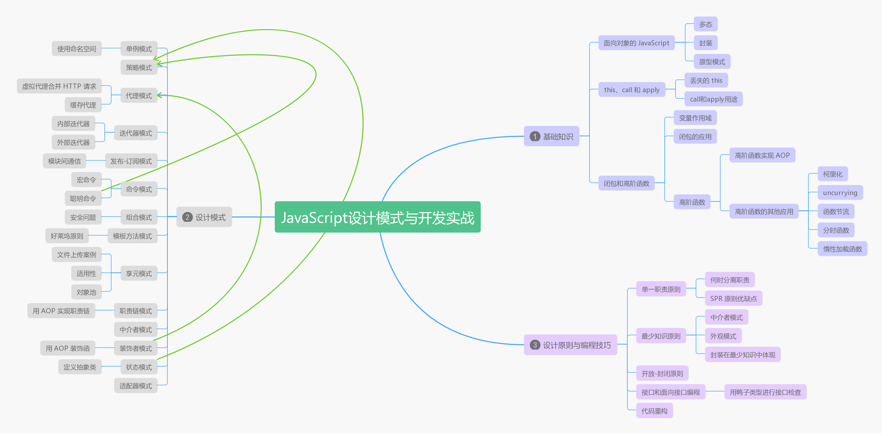

> 书名: JavaScript 设计模式与开发实战<br>
> 出版社: 图灵社区<br>
> 网页： http://www.ituring.com.cn/book/1632



<!-- TOC -->

- [基础知识](#基础知识)
    - [面向对象的 JavaScript](#面向对象的-javascript)
        - [多态 polymorphism](#多态-polymorphism)
        - [封装](#封装)
        - [原型模式](#原型模式)
    - [this、call 和 apply](#thiscall-和-apply)
        - [丢失的 this](#丢失的-this)
        - [call和apply用途](#call和apply用途)
    - [闭包和高阶函数](#闭包和高阶函数)
        - [变量作用域](#变量作用域)
        - [变量的生存周期](#变量的生存周期)
        - [闭包的应用](#闭包的应用)
        - [高阶函数](#高阶函数)
            - [高阶函数实现 AOP](#高阶函数实现-aop)
            - [高阶函数的其他应用](#高阶函数的其他应用)
- [设计模式](#设计模式)
    - [单例模式](#单例模式)
        - [使用命名空间](#使用命名空间)
    - [策略模式](#策略模式)
        - [利用策略模式实现动画效果](#利用策略模式实现动画效果)
    - [代理模式](#代理模式)
        - [虚拟代理合并 HTTP 请求](#虚拟代理合并-http-请求)
        - [缓存代理](#缓存代理)
    - [迭代器模式](#迭代器模式)
    - [发布-订阅模式](#发布-订阅模式)
        - [模块间通信](#模块间通信)
    - [命令模式](#命令模式)
        - [宏命令](#宏命令)
    - [组合模式](#组合模式)
        - [安全问题](#安全问题)
        - [注意地方](#注意地方)
        - [适用场景](#适用场景)
    - [模板方法模式](#模板方法模式)
        - [好莱坞原则](#好莱坞原则)
    - [享元模式](#享元模式)
        - [文件上传案例](#文件上传案例)
        - [适用性](#适用性)
        - [对象池](#对象池)
    - [职责链模式](#职责链模式)
        - [用 AOP 实现职责链](#用-aop-实现职责链)
    - [中介者模式](#中介者模式)
    - [装饰者模式](#装饰者模式)
        - [用 AOP 装饰函数](#用-aop-装饰函数)
        - [装饰者模式和代理模式](#装饰者模式和代理模式)
    - [状态模式](#状态模式)
        - [定义抽象类](#定义抽象类)
        - [和策略模式关系](#和策略模式关系)
    - [适配器模式](#适配器模式)
- [设计原则和编程技巧](#设计原则和编程技巧)
    - [单一职责原则](#单一职责原则)
        - [何时分离职责](#何时分离职责)
        - [SPR 原则优缺点:](#spr-原则优缺点)
    - [最少知识原则](#最少知识原则)
        - [封装在最少知识中体现](#封装在最少知识中体现)
    - [开放-封闭原则](#开放-封闭原则)
        - [设计模式中的开发-封闭原则](#设计模式中的开发-封闭原则)
    - [接口和面向接口编程](#接口和面向接口编程)
        - [用鸭子类型进行接口检查](#用鸭子类型进行接口检查)
    - [代码重构](#代码重构)

<!-- /TOC -->

# 基础知识
## 面向对象的 JavaScript
> JavaScript 没有提供传统的面向对象的类式继承和对抽象类、接口的支持，而是通过原型委托的方式实现对象间的继承。

编程语言分静态语言、动态语言:

静态语言优点是在编译时就能发现类型不匹配的错误和明确数据类型，提高编译速度。缺点是迫使程序员依照强契约来编写程序。

动态语言优点是编写代码量少，看起来简洁，程序员可以把精力更多地放在业务逻辑上面。缺点是无法保证变量类型，运行期间可能发生类型错误。

JavaScript 是动态语言，无需进行类型检测，可以调用对象的任意方法。这一切都建立在**鸭子类型**上，即：如果它走起路来像鸭子，叫起来像鸭子，那它就是鸭子。

鸭子模型指导我们关注对象的行为，而不是对象本身，也就是关注 Has-A，而不是 Is-A。利用鸭子模式就可以实现动态类型语言一个原则"面向接口编程而不是面向实现编程"

### 多态 polymorphism
> 同一操作作用于不同对象上面，就可以产生不同的解释和不同执行结果。

背后思想是将"做什么"和"谁去做、怎么做"分离开来，即将"不变的事物"与"可能改变的事物"分离开来。把不变的隔离开来，把可变部分封装，也符合开放-封闭原则。

```javascript
var makeSound = function( animal ) {
    animal.sound();
}
// 调用,传入不同对象
makeSound(new Duck());
makeSound(new Chicken());
```
使用继承得到多态效果，是让对象表现出多态性最常用手段。继承包括实现继承和接口继承。JavaScript 变量类型在运行期是可变的，所以 JavaScript 对象多态性是与生俱来的。

### 封装
> 封装的目的是将信息隐藏。封装包括封装数据、封装实现、封装类型、封装变化。

从设计模式层面，封装在最重要的层面是封装变化。设计模式可划分为
- 创建型模式: 创建一个对象，是一种抽象行为，目的是封装对象的行为变化
- 结构型模式: 封装结构之间的组合关系
- 行为型模式: 封装对象的行为变化

### 原型模式
JavaScript 是基于原型继承的。原型模式不单是一种设计模式，还是一种编程泛型。

如果使用原型模式，只需要调用负责克隆方法，便能完成相同功能。原型模式实现关键，是语言本身是否提供了 clone 方法。 ECMAScript5 提供了 `Object.create` 方法。

在不支持 `Object.create` 方法浏览器写法:
```javascript
Object.create = Object.create || function(obj) {
    var F = function() {};
    F.prototype = obj;
    return new F();
}
```

通过原型模式克隆出一模一样对象，原型模式提供一种便捷方式去创建某个类的对象，克隆只是创建对象的手段。

原型继承本质: 基于原型链的委托机制。

**原型变成泛型至少包括以下规则**:
- 所有数据都是对象
- 要得到一个对象，不是通过实例化类，而是找到一个对象作为原型并克隆它
- 对象会记住它的原型
- 如果对象无法响应某个请求，它会把这个请求委托给它自己的原型

JavaScript 中根对象是 `Object.prototype` 对象. `Object.prototype` 是一个空的对象。 JavaScript 的每个对象，都是从 `Object.prototype` 克隆而来。

ECMAScript5 提供 `Object.getPrototypeOf` 查看对象原型
```javascript
var obj = new Object();
console.log(Object.getPrototypeOf(obj) === Object.prototype); // true
```

JavaScript 函数既可以作为普通函数被调用，也可以作为构造器被调用。通过 `new` 运算符来创建对象，实际操作是先克隆 `Object.prototype` 对象，再进行一些其他额外的操作过程。

`new` 运算过程:
```javascript
var objectFactory = function() {
    var obj = new Object(); // 克隆一个空对象
    Constructor = [].shift.call(arguments); // 取得外部传入构造器
    obj.__proto__ = Constructor.prototype; // 指向正确的类型
    var ret = Constructor.apply(obj, arguments); //借用外部传入构造器给 obj 设置属性
    return typeof ret === 'object' ? ret : obj; // 确保构造器总会返回一个对象。
}
// 使用函数
function A(name) {this.name = name;}
var a = objectFactory(A, 'tom');
```
JavaScript 给对象提供了一个名为 `__proto__` 的隐藏属性,某个对象的 `__proto__` 属性默认会指向它的构造器的原型对象，即`{Constructor}.prototype`。 Chrome 和 Firefox 等向外暴露了对象的`__proto__`属性。
```javascript
var a = new Object();
console.log(a.__proto__ === Object.prototype); // true
```
> 当前 JavaScript 引擎下，通过 `Object.create` 来创建对象效率不高，通常比构造函数创建对象慢。

## this、call 和 apply
JavaScript的 this 总是指向一个对象，而具体指向哪个对象实在运行时基于函数的执行环境动态绑定的，而非函数被声明时的环境。

除去不常用的 with 和 eval 情况，具体到实际应用中， this 的指向大致情况分四种:
1. 作为对象的方法调用:当函数作为对象方法调用时， this 指向该对象
    ```javascript
    var obj = {
        a: 1,
        getA: function() {
            alert(this === obj); // true
            alert(this.a); // 输出: 1
        }
    }
    obj.getA();
    ```
2. 作为普通函数调用:当函数不作为对象被调用时，this 总指向全局对象。这个全局对象是 window 对象.
    ```javascript
    window.name = 'globalName';
    var getName = function() {
        return this.name;
    }
    console.log(getName()); // globalName
    ```
    ECMAScript5 严格模式下，this 指向 undefined

3. 构造器调用: 当 new 运算符调用函数时，该函数总会返回一个对象， this 指向这个对象
    ```javascript
    var MyClass = function() {
        this.name = 'sven';
    }
    var obj = new MyClass();
    alert(obj.name); // sven;
    ```
    > 需要注意的是，如果构造器显式返回一个object类型的对象，那么此次运算结果最终会返回这个对象，而不是 this:
    ```javascript
    var MyClass = function() {
        this.name = 'sven';
        return { // 显式返回一个对象
            name: 'name'
        }
    }
    var obj = new MyClass();
    alert(obj.name); // name;
    ```
4. `Function.prototype.call` 或 `Function.prototype.apply` 调用: 可以动态改变传入的 this， 函数式编程的常用函数
    ```javascript
    var obj1 = {
        name: 'sven',
        getName: function() {
            return this.name;
        }
    };
    var obj2 = {
        name: 'name'
    };
    console.log(obj1.getName()); // sven
    console.log(obj1.getName.call(obj2)); // name
    ```
   
### 丢失的 this
替代函数 `document.getElementById` 这个过长的函数,使用:
```javaScript
var getId = function(id) {
    return document.getElementById(id);
}
getId('div1');
```
执行时，会抛出异常，因为许多引擎的 `document.getElementById` 方法的内部实现中需要用到 this。 当用 `getId` 引用的时候， this 指向的是 window，而不是原来的 document，可以利用 apply 来修正
```javascript
document.getElementById = (function(func) {
    return function() {
        return func.apply(document, arguments);
    }
})(document.getElementById);
var getId = document.getElementById;
getId('div1');
```
### call和apply用途

call 和 apply 都是非常常用的方法。作用一模一样，区别仅在于传入参数形式的不同。

`apply` 接受两个参数， 第一个参数指定了函数体内 this 对象的指向，第二个参数为一个带下标的集合，这个集合可以为数组，也可以为类数组。

`call` 传入参数数量不固定，跟 apply 相同的是，第一个参数也是代表函数体内的 this 指向，从第二个参数开始往后，每个参数被依次传入函数。

实际用途:
1. 改变 this 指向
2. `Function.prototype.bind`: 指定函数内部的 this

简化版bind
```javascript
Function.prototype.bind = function(context) {
    var self = this; // 保持原函数
    return function() {
        // 返回一个新的函数
        return self.apply(context, arguments);
        // 执行新的函数时候，会把之前传入的context当做新函数体内的this
    }
}
```
优化版bind: 可以预先填入一些参数
```javascript
Function.prototype.bind = function() {
    var self = this; // 保持原函数
    // 需要绑定的 this 上下文
    var context = [].shift.call(arguments);
    // 剩余参数转换为数组
    var args = [].slice.call(arguments);
    return function() {
        // 返回一个新的函数
        return self.apply(context, [].concat.call(args, [].slice.call(arguments)));
        // 执行新的函数时候，会把之前传入的context当做新函数体内的this
        // 并组合两次分别传入的参数，作为新函数的参数
    }
}
var obj = {name: 'sven'};
var func = function(a, b, c, d) {
    alert(this.name); // sven
    alert([a, b, c, d]); // [1, 2, 3, 4]
}.bind(obj, 1, 2);
func(3, 4);
```
3. 借用其他对象的方法
借用构造函数，实现类似继承的效果
```javascript
var A = function(name) {this.name = name;}
var B = function() {A.apply(this, arguments);}
var b = new B('sven');
```
函数参数列表 arguments 是一个类数组对象，虽然它也有下标，但它并非真正的数组，所以不能使用数组的相关函数，这时常借用 `Array.prototype` 对象上的方法。
```javascript
(function(){
    Array.prototype.push.call(arguments, 3);
    console.log(arguments); // [1, 2, 3]
})(1, 2);
```
V8 引擎中 `Array.prototype.push` 的实现
```javascript
function ArrayPush() {
    var n = TO_UINT32( this.length ); // 被 push 对象的 length
    var m = %_ArgumentsLength(); // push参数个数
    for(var i=0; i<m; i++) {
        this[i+n] = %_ArgumentsLength(i); // 复制元素
    }
    this.length = n + m; // 修正 length 属性的值
    return this.length;
}
```
`Array.prototype.push` 实际上是一个属性复制的过程，把参数按照下标依次添加到被 push 的对象上面，顺便修改了这个对象的 length 属性。由此推断，我们可以把任意对象传入 `Array.prototype.push`
```javascript
var a = {};
Array.prototype.push.call(a, 'first');
alert(a.length); // 1
alert(a[0]); // first
```
`Array.prototype.push` 要满足两个条件
- 对象本身可以存取属性, 传入 number 类型没有效果
- 对象的 length 属性可读写, 传入函数调用 length 会报错

## 闭包和高阶函数
闭包的形成和变量的作用域以及变量的生存周期密切相关。

### 变量作用域
> 变量作用域指的是变量的有效范围。

当声明一个变量没有使用 `var` 的时候，变量会变为全局变量，容易造成命名冲突。用 `var` 关键字在函数中声明变量，这时变量为局部变量，只能在函数内部访问。

在 JavaScript 中，函数可以用来创造函数作用域。搜索变量时，会随着代码执行环境创建的**作用域链**往外层逐层搜索，一直搜索到全局对象为止。

### 变量的生存周期
对于全局变量，生存周期是永久的，除非我们主动销毁这个全局变量。而函数内部 `var` 声明的变量，当退出函数时，这些局部变量便失去价值，会随着函数结束而销毁。

```javascript
var func  = function() {
    var a = 1;
    return function() {
        a++;
        console.log(a);
    }
}
var f = func();
f(); // 2
f(); // 3
```
当退出函数后，变量 `a` 并没有消失,当执行 `var f = func()` ，返回一个匿名函数的引用，它可以反问到 `func()` 被调用时产生的环境，而局部变量 `a` 一直处在这个环境里。既然这个局部变量还能被访问，就不会被销毁。这里产生了一个闭包结构。 

### 闭包的应用

1. **封装变量**: 把一些不需要暴露在全局的变量封装成"私有变量"
2. **延续局部变量的寿命**: 在一些低版本浏览器实现发送请求可能会丢失数据，每次请求并不都能成功发送 HTTP 请求,原因在于局部变量可能随时被销毁，而这时还没发送请求，造成请求丢失。可以用闭包封装，解决问题:
```javascript
var report = (function() {
    var imgs = [];
    return function(src) {
        var img = new Image();
        imgs.push(img);
        img.src = src;
    }
})
```
3. **利用闭包实现完整的面向对象系统**
4. **闭包实现命令模式**: 命令模式意图是把请求封装为对象，从而分离请求的发起者和接收者之间的耦合关系。在命令执行之前，可以预先往命令模式植入接收者。闭包可以完成这个工作，把命令接受者封闭在闭包形成的环境中。
```javascript
var TV = {
    open: function() {
        consoel.log('打开电视');
    },
    close: function() {
        console.log('关闭电视');
    }
}
var createCommand = function(receiver) {
    var execute = function() {
        return receiver.open();
    }
    var undo = function() {
        return receiver.close();
    }
    return {
        execute: execute,
        undo: undo
    }
};
var setCommand = function(command) {
    document.getElementById('execute').onclick = function() {
        command.execute();
    }
    document.getElementById('undo').onclick = function() {
        command.undo();
    }
}
setCommand(createCommand(TV));
```
5. **闭包和内存管理**: 使用闭包的同时比较容易形成循环引用，如果闭包的作用域链中保存着一些 DOM 节点，这时候就有可能造成内存泄漏。在 IE 浏览器中， 由于 BOM 和 DOM 中的对象是使用 C++ 以 COM 对象的方式实现的，而 COM 对象的垃圾收集机制是引用计数策略，在基于引用计数策略的垃圾回收机制中，如果两对象形成循环引用，就可能使得对象无法回收，造成内存泄漏。

### 高阶函数
高阶函数至少满足以下条件:
- 函数可以作为参数被传递
   1. 回调函数: 例如 ajax 异步请求的应用
   2. `Array.prototype.sort` 接收函数指定排序规则
- 函数可以作为返回值输出
   1. 判断数据类型 
   2. getSingle 单例模式
   
```javascript
// 类型判断
var isString = function(obj) {
    return Object.prototype.toString.call(obj) === '[object String]';
}
var isArray = function(obj) {
    return Object.prototype.toString.call(obj) === '[object Array]';
}
var isNumber = function(obj) {
    return Object.prototype.toString.call(obj) === '[object Number]';
}
// 使用闭包优化
var isType = function(type) {
    return function(obj) {
        return Object.prototype.toString.call(obj) === '[object '+ type +']';
    }
}
var isString = isType('String');
var isArray = isType('Array');
var isNumber = isNumber('Number');
// getSingle
var getSingle = function(fn) {
    var ret;
    return function() {
        return ret || (ret = fn.apply(this, arguments));
    }
}
```
#### 高阶函数实现 AOP
> AOP 面向切面编程: 主要作用把一些跟核心业务逻辑模块无关的功能抽离出来，这些跟业务逻辑无关的功能包括日志统计、安全控制、异常处理等。

Java中实现AOP，通过反射和动态代理机制实现，JavaScript则是把一个函数"动态织入"另一个函数中,可以通过扩展 `Function.prototype` 实现

使用了装饰者模式:
```javascript
Function.prototype.before = function(beforefn) {
    var __self = this; // 保存原函数的引用
    return function() {
        // 返回包含了原函数和新函数的代理函数
        beforefn.apply(this, arguments);
        return __self.apply(this,arguments);
    }
}
Function.prototype.after = function(afterfn) {
    var __self = this;
    return function() {
        var ret = __self.apply(this, arguments);
        afterfn.apply(this, arguments);
        return ret;
    }
}
var func = function() {console.log(2);}
func = func.before(function(){ 
    console.log(1);
}).after(function(){
    console.log(3);
});
func(); // 1 2 3
```

#### 高阶函数的其他应用
1. **currying**: 柯里化,又称部分求值。一个 currying 的函数首先接受一些参数，然后返回另一个函数，刚才传入的参数在函数形成闭包中被保存起来。待到函数被真正需要求值的时候，之前传入的参数一次性应用于求值。

通用 currying
```javascript
var currying = function(fn) {
    var args = [];
    return function() {
        if(arguments.length === 0) {
            return fn.apply(this, args);
        } else {
            [].push.apply(args, arguments);
            return arguments.callee;
        }
    }
}
// 案例
var cost = (function() {
    var money = 0;
    return function() {
        for(var i = 0, l = arguments.length; i < l; i++) {
            money += arguments[i];
        }
        return money;
    }
});
var cost = currying(cost); // 转化成curring函数
cost(100);
cost(200);
cost(300);
cost(); // 600
```
2. **uncurrying**: 把泛化的 this 提取出来。

实现方式之一:
```javascript
Function.prototype.uncurrying = function() {
    var self = this;
    return function() {
        var obj = Array.prototype.shift.call(arguments);
        return self.apply(obj, arguments);
    }
}
// 转化数组的push为通用函数
var push = Array.prototype.push.uncurrying();
(function(){
    push( arguments, 4);
    console.log(arguments); // 1， 2， 3， 4
})(1, 2, 3);
```
3. **函数节流**: 在一些场景下，函数有可能被非常频繁地调用，而造成大的性能问题。例如
   - `window.onresize`事件,当浏览器窗口大小被拖动而改变时，事件触发频率非常高
   - `mousemove`事件,拖拽事件
   - 上传进度。频繁的进行进度通知

这些的共同问题是函数被触发的频率太高。

代码实现: throttle 函数的原理是将即将被执行的函数用 setTimeout 延迟一段时间执行。如果该次延迟执行还没有完成，则会忽略接下来调用该函数的请求。 throttle 函数接受2个参数，第一个参数为需要延迟执行的函数，第二个参数为延迟执行的时间
```javascript
var throttle = function(fn, interval) {
    var __self = fn; // 保存需要被延迟执行的函数引用
    var timer; // 定时器
    var firstTime = true; // 是否是第一次调用
    return function() {
        var args = arguments;
        var _me = this;
        if(firstTime) {
            // 如果是第一次调用，不需要延迟执行
            __self.apply(__me, args);
            return firstTime = false;
        }
        if(timer) {
            // 如果定时器还在，说明前一次延迟执行还没有完成
            return false;
        }
        timer = setTimeout(function(){
            clearTimout(timer);
            timer = null;
            __self.apply(__me, args);
        }, interval || 500);
    };
};
// 案例
window.onresize = throttle(function() {
    console.log(1);
}, 500);
```
4. **分时函数**: 某些函数由用户主动调用，但是因为一些客观原因，会严重影响页面的性能。比如在页面中一次性渲染包含成千上百个节点的页面，在短时间内往页面中大量添加 DOM 节点会让浏览器吃不消，造成浏览器卡顿甚至假死。

解决方案之一是下面的 timeChunk 函数，让创建节点的工作分批进行。 timeChunk 函数接受3个参数，第一个参数是创建节点用到的数据，第2个参数是封装了创建节点逻辑的函数，第3个参数表示每一批创建节点数量。
```javaScript
var timeChunk = function(ary, fn, count) {
    var obj;
    var t;
    var len = ary.length;
    var start = function() {
        for(var i = 0;i < Math.min(count || 1, ary.length); i++) {
            var obj = ary.shift();
            fn(obj);
        }
    };
    return function() {
        t = setInterval(function() {
            if(ary.length === 0) {
                // 如果节点都已经被创建好
                return clearInterval(t);
            }
            start();
        }, 200);
    };
};
```
5. **惰性加载函数**: 第一次进入条件分支后，在函数内部重写这个函数，重写后的函数就是我们期望的函数，下一次再进入该函数就不再存在分支语句
```javascript
var addEvent = function(elem, type, handler) {
    if(window.addEventListener) {
        addEvent = function(elem, type, handler) {
            elem.addEventListener(type, handler, false);
        }
    } else if(window.attachEvent) {
        addEvent = function(elem, type, handler) {
            elem.attachEvent('on'+type, handler);
        }
    }
    addEvent(elem, type, handler);
}
```

# 设计模式
介绍了 JavaScript 开发中常见的 14种设计模式

## 单例模式
> 定义是: 保证一个类仅有一个实例，并提供一个访问它的全局访问点。

```javascript
var Singleton = function(name) {
    this.name = name;
    this.instacne = null;
}
Singleton.getInstance = (function() {
    var instance = null;
    return function(name) {
        if(!instance) {
            instance = new Singleton(name);
        }
        return instane;
    }
})
```
可以通过结合代理模式来实现单例模式。

### 使用命名空间
适当使用命名空间，并不会杜绝全局变量，减少全局变量数量
```javascript
var namespace = {
    a: function () {alert(1);},
    b: function () {alert(2);}
}
```
动态创建命名空间
```javascript
var MyApp = {};
MyApp.namespace = function(name) {
    var parts = name.splice('.');
    var current = MyApp;
    for(var i in parts) {
        if(!current[parts[i]]) {
            current[parts[i]] = {};
        }
        current = current[parts[i]];
    }
}
// 案例
MyApp.namespace('dom.style');
var MyApp = {
    dom: {
        style: {}
    }
}
```

惰性单例模式: 指需要的时候才创建对象实例。
```javascript
var getSingle = function(fn) {
    var result;
    return function() {
        return result || (result = fn.apply(this, arguments));
    }
}
```
传入创建对象的函数，之后再让 getSingle 返回一个新的函数，并且用一个变量 result 来保存 fn 的计算结果。 result 变量因为身在闭包中，它永远不会被销毁。

这样就把创建实例对象的职责和管理单例的职责分别放置在两个方法里，这两个方法独立变化互不影响，当他们连接在一起时，就完成了创建唯一实例对象的功能。符合单一职责原则。

不仅用于创建对象，还可用于绑定事件。

## 策略模式
> 定义是: 定义一系类的算法，把它们一个个封装起来，并且使它们可以互相替换。

一个基于策略模式的程序至少由两部分组成。第一个部分是一组策略类，策略类封装了具体的算法，并负责具体的计算过程。第二个部分是环境类 Context，Context 接收客户的请求，随后请求委托给某一个策略类。 Context 中维持对某个策略对象的引用。
```javascript
var strategies = {
    'S': function(salary) {
        return salary * 4;
    },
    'A': function(salary) {
        return salary * 3;
    },
    'B': function(salary) {
        return salary * 2;
    }
};
var calculateBonus = function(level, salary) {
    return strategies[level](salary);
}
// 案例
console.log(calculateBonus('S', 20000));
```
### 利用策略模式实现动画效果
```html
<body>
    <div style="position:absolute;background:blue" id="div">我是div</div>

</body>
<script>
    // 定义动画的策略
    var tween = {
        linear: function(t, b, c, d) {
            return c * t / d + b;
        },
        easeIn: function(t, b, c, d) {
            return c * (t /= d) * t + b;
        },
        strongEaseIn: function(t, b, c, d) {
            return c * (t /= d) * t * t * t * t + b;
        },
        strongEaseOut: function(t, b, c, d) {
            return c * ((t = t / d - 1) * t * t * t * t + 1) + b;
        },
        sineaseIn: function(t, b, c, d) {
            return c * (t /= d) * t * t + b;
        },
        sineaseOut: function(t, b, c, d) {
            return c * ((t = t / d - 1) * t * t + 1) + b;
        }
    };
    // 定义动画类
    var Animate = function(dom) {
        this.dom = dom; // 进行运动的dom 节点
        this.startTime = 0; // 动画开始时间
        this.startPos = 0; // 动画开始时，dom 节点的位置，即dom 的初始位置
        this.endPos = 0; // 动画结束时，dom 节点的位置，即dom 的目标位置
        this.propertyName = null; // dom 节点需要被改变的css 属性名
        this.easing = null; // 缓动算法
        this.duration = null; // 动画持续时间
    };


    Animate.prototype.start = function(propertyName, endPos, duration, easing) {
        this.startTime = +new Date; // 动画启动时间
        this.startPos = this.dom.getBoundingClientRect()[propertyName]; // dom 节点初始位置
        this.propertyName = propertyName; // dom 节点需要被改变的CSS 属性名
        this.endPos = endPos; // dom 节点目标位置
        this.duration = duration; // 动画持续事件
        this.easing = tween[easing]; // 缓动算法
        var self = this;
        var timeId = setInterval(function() { // 启动定时器，开始执行动画
            if (self.step() === false) { // 如果动画已结束，则清除定时器
                clearInterval(timeId);
            }
        }, 19);
    };
    // 小球运动每一帧要做的事情
    Animate.prototype.step = function() {
        var t = +new Date; // 取得当前时间
        if (t >= this.startTime + this.duration) { // 判断动画时间是否结束
            this.update(this.endPos); // 更新小球的CSS 属性值
            return false;
        }
        var pos = this.easing(t - this.startTime, this.startPos, this.endPos - this.startPos, this.duration);
        // pos 为小球当前位置
        this.update(pos); // 更新小球的CSS 属性值
    };
    // 更新运动属性
    Animate.prototype.update = function(pos) {
        this.dom.style[this.propertyName] = pos + 'px';
    };

    var div = document.getElementById('div');
    var animate = new Animate(div);
    animate.start('left', 500, 1000, 'strongEaseOut');
</script>
```

在实际开发中，我们常把算法含义扩散开来，使策略模式也可以封装一系列业务规则。例如利用策略模式来进行表单验证。

```javascript
/*************** 策略对象 *******************/
var strategies = {
    isNonEmpty: function(value, errorMsg) { // 不为空
        if (value === '') {
            return errorMsg;
        }
    },
    minLength: function(value, length, errorMsg) { // 限制最小长度
        if (value.length < length) {
            return errorMsg;
        }
    },
    isMobile: function(value, errorMsg) { // 手机号码格式
        if (!/(^1[3|5|8][0-9]{9}$)/.test(value)) {
            return errorMsg;
        }
    }
};
/****** 定义类来保存要检验的内容 **********/
var Validator = function() {
    this.cache = []; // 保存校验规则
};
Validator.prototype.add = function(dom, rule, errorMsg) {
    var ary = rule.split(':'); // 把strategy 和参数分开
    this.cache.push(function() { // 把校验的步骤用空函数包装起来，并且放入cache
        var strategy = ary.shift(); // 用户挑选的strategy
        ary.unshift(dom.value); // 把input 的value 添加进参数列表
        ary.push(errorMsg); // 把errorMsg 添加进参数列表
        return strategies[strategy].apply(dom, ary);
    });
};
Validator.prototype.start = function() {
    for (var i = 0, validatorFunc; validatorFunc = this.cache[i++];) {
        var msg = validatorFunc(); // 开始校验，并取得校验后的返回信息
        if (msg) { // 如果有确切的返回值，说明校验没有通过
            return msg;
        }
    }
};
/********** 客户调用代码 *******************/
var validataFunc = function() {
    var validator = new Validator(); // 创建一个validator 对象
    /***************添加一些校验规则****************/
    validator.add(registerForm.userName, 'isNonEmpty', '用户名不能为空');
    validator.add(registerForm.password, 'minLength:6', '密码长度不能少于6 位');
    validator.add(registerForm.phoneNumber, 'isMobile', '手机号码格式不正确');
    var errorMsg = validator.start(); // 获得校验结果
    return errorMsg; // 返回校验结果
}
var registerForm = document.getElementById('registerForm');
registerForm.onsubmit = function() {
    var errorMsg = validataFunc(); // 如果errorMsg 有确切的返回值，说明未通过校验
    if (errorMsg) {
        alert(errorMsg);
        return false; // 阻止表单提交
    }
};
```

策略模式优点:
1. 利用组合、委托、多态等技术和思想，可以有效地避免多重条件选择语句
2. 提供了对开封-封闭原则的完美支持，将算法封装在独立的 strategy中，使得它们易于切换，易于理解，易于扩展。
3. 算法可以复用到系统其他地方，从而避免许多重复的复制粘贴操作
4. 利用组合和委托来让 Context 拥有执行算法的能力，也是继承的一种替代方案

## 代理模式
> 代理模式是为一个对象提供一个代用品或占位符，以便控制对它的访问。

两种代理模式: 通过代理拒绝某些请求的方式为**保护代理**，用于控制不同权限对象对目标对象的访问; 把一些开销很大的对象，延迟到真正需要它的时候才创建为**虚拟代理**。

虚拟代理案例:
```javascript
var myImage = (function() {
    var imgNode = document.createElement('img');
    document.body.appendChild(imgNode);
    return {
        setSrc: function(src) {
            imgNode.src = src;
        }
    }
})();
// 代理，先显示本地图片，加载完成后显示网络图片
var proxyImage = (function() {
    var img = new Image;
    img.onload = function() {
        myImage.setSrc(this.src);
    }
    return {
        setSrc: function(src) {
            myImage.setSrc('loading.jpg');
            img.src = src;
        }
    }
})();
proxyImage.setSrc('https://p.qpic.cn/music_cover/Fe6emiag6IuVbMib3oN6yctRX8ZBICoa4liaYZkwZoSCaJdw7tOW5bCiaA/300?n=1');
```
> 单一职责原则: 就一个类而言，应该仅有一个引起它变化的原因。职责被定义为"引起变化的原因"。

如果代理对象和本体对象都为一个函数，函数必然都能被执行，则可以认为他们也具有一致的“接口”。
```javascript
var myImage = (function() {
    var imgNode = document.createElement('img');
    document.body.appendChild(imgNode);
    // 返回函数
    return function(src) {
        imgNode.src = src;
    }
})();
```

### 虚拟代理合并 HTTP 请求
```javascript
// 发送文件的时间，用于绑定事件，并且在点击的同时往另一台服务器同步文件：
var synchronousFile = function(id) {
    console.log('开始同步文件，id 为: ' + id);
};
// 延迟2秒，把所有请求一起发送，减轻服务器负担
var proxySynchronousFile = (function() {
    var cache = [], // 保存一段时间内需要同步的ID
        timer; // 定时器
    return function(id) {
        cache.push(id);
        if (timer) { // 保证不会覆盖已经启动的定时器
            return;
        }
        timer = setTimeout(function() {
            synchronousFile(cache.join(',')); // 2 秒后向本体发送需要同步的ID 集合
            clearTimeout(timer); // 清空定时器
            timer = null;
            cache.length = 0; // 清空ID 集合
        }, 2000);
    }
})();
```
### 缓存代理
缓存代理可以为一些开销大的运算结果提供暂时的存储，在下次运算时，如果传递进来的参数跟之前的一致，可以直接返回前面存储的运算结果。
```javascript
/**************** 计算乘积 *****************/
var mult = function(){
    var a = 1;
    for ( var i = 0, l = arguments.length; i < l; i++ ){
        a = a * arguments[i];
    }
    return a;
};
/**************** 计算加和 *****************/
var plus = function(){
    var a = 0;
    for ( var i = 0, l = arguments.length; i < l; i++ ){
        a = a + arguments[i];
    }
    return a;
};
/********* 创建缓存代理的工厂 *************/
var createProxyFactory = function( fn ){
    // 建立缓存对象
    var cache = {};
    return function(){
        var args = Array.prototype.join.call( arguments, ',' );
        if ( args in cache ){
            return cache[ args ];
        }
        return cache[ args ] = fn.apply( this, arguments );
    }
};
// 案例
var proxyMult = createProxyFactory( mult ),
proxyPlus = createProxyFactory( plus );
console.log( proxyMult( 1, 2, 3, 4 ) ); // 输出：24
console.log( proxyPlus( 1, 2, 3, 4 ) ); // 输出：10
```

其他代理模式: 防火墙代理、远程代理、保护代理、智能引用代理等

## 迭代器模式
> 迭代器模式指提供一种方法顺序访问一个聚合对象中的各个元素，而又不需要暴露该对象的内部表示。如 JavaScript 中的 `Array.prototype.forEach`

内部迭代器: 接受2个参数，第一个为被循环的数组，第二个为循环中的每一步后将触发的回调函数。内部迭代器调用方便，外界不用关心内部实现，跟迭代器交互仅第一次初始调用，缺陷是内部迭代规则无法进行修改。
```javascript
var each = function(ary, callback) {
    for(var i = 0, l = ary.length; i < l; i++) {
        callback.call(ary[i], i, ary[i]); // 把下标和元素作为参数传给callback函数
    }
}
```
外部迭代器: 必须显示请求迭代下一个元素。增加了调用复杂度，但也相对增加了灵活性。
```javascript
// 适用面更广，能满足更多变的需求
var Iterator = function( obj ){
    var current = 0;
    var next = function(){
        current += 1;
    };
    var isDone = function(){
        return current >= obj.length;
    };
    var getCurrItem = function(){
        return obj[ current ];
    };
    return {
        next: next,
        isDone: isDone,
        getCurrItem: getCurrItem
    }
};
// 比较函数
var compare = function( iterator1, iterator2 ){
    while( !iterator1.isDone() && !iterator2.isDone() ){
        if ( iterator1.getCurrItem() !== iterator2.getCurrItem() ){
            throw new Error ( 'iterator1 和iterator2 不相等' );
        }
        iterator1.next();
        iterator2.next();
    }
    console.log( 'iterator1 和iterator2 相等' );
}
var iterator1 = Iterator( [ 1, 2, 3 ] );
var iterator2 = Iterator( [ 1, 2, 3 ] );
compare( iterator1, iterator2 ); // 输出：iterator1 和iterator2 相等
```
迭代器模式不仅可以迭代数组，还可以迭代一些类数组对象。只要被迭代的聚合对象具有 length 属性且可以用下标访问，就可以被迭代。
```javascript
// 倒序迭代器
var reverseEach = function(ary, callback) {
    for(var l = ary.length-1; l >= 0; l--) {
        callback(l, ary[l]);
    }
}
// 终止迭代器
var each = function( ary, callback ){
    for ( var i = 0, l = ary.length; i < l; i++ ){
        if ( callback( i, ary[ i ] ) === false ){ // callback 的执行结果返回false，提前终止迭代
            break;
        }
    }
};
```

## 发布-订阅模式
> 发布订阅模式又叫观察者模式，它定义对象间的一种一对多的依赖关系，当一个对象的状态发生改变时，所有依赖于它的对象都将得到通知。

发布订阅模式可以广泛应用于异步编程中，这是一种替代传递回调函数的方案。发布订阅模式可以取代对象之间硬编码的通知机制，一个对象不用再显式地调用另外一个对象的某个接口。

DOM 节点上绑定事件函数就是应用了发布订阅模式。

通用发布-订阅模式代码:
```javascript
var event = {
    clientList: [], // 二维数据，用于保存订阅事件
    listen: function( key, fn ){ // 订阅事件
        if ( !this.clientList[ key ] ){
            this.clientList[ key ] = [];
        };
        this.clientList[ key ].push( fn ); // 订阅的消息添加进缓存列表
    },
    trigger: function(){ // 发布事件
        var key = Array.prototype.shift.call( arguments ), // 获得事件 key
        fns = this.clientList[ key ];
        if ( !fns || fns.length === 0 ){ // 如果没有绑定对应的消息
            return false;
        }
        for( var i = 0, fn; fn = fns[ i++ ]; ){
            fn.apply( this, arguments ); // arguments 是trigger 时带上的参数
        }
    },
    remove: function( key, fn ){ // 移除订阅
		var fns = this.clientList[ key ];
		if ( !fns ){ // 如果key 对应的消息没有被人订阅，则直接返回
			return false;
		}
		if ( !fn ){ // 如果没有传入具体的回调函数，表示需要取消key 对应消息的所有订阅
			fns && ( fns.length = 0 );
		}else{
			for ( var l = fns.length - 1; l >=0; l-- ){ // 反向遍历订阅的回调函数列表
				var _fn = fns[ l ];
				if ( _fn === fn ){
					fns.splice( l, 1 ); // 删除订阅者的回调函数
				}
			}
		}
	}
};
// 可以给所有的对象安装发布-订阅功能
var installEvent = function( obj ){
    for ( var i in event ){
        obj[ i ] = event[ i ];
    }
};
```
### 模块间通信
利用发布订阅模式，可以在两个封装良好的模块中通信，这两个模块完全不知道对方的存在。
```javascript
// 通用发布-订阅模式
var Event = (function() {
    var clientList = {},
        listen,
        trigger,
        remove;
    listen = function(key, fn) {
        if (!clientList[key]) {
            clientList[key] = [];
        }
        clientList[key].push(fn);
    };
    trigger = function() {
        var key = Array.prototype.shift.call(arguments),
            fns = clientList[key];
        if (!fns || fns.length === 0) {
            return false;
        }
        for (var i = 0, fn; fn = fns[i++];) {
            fn.apply(this, arguments);
        }
    };
    remove = function(key, fn) {
        var fns = clientList[key];
        if (!fns) {
            return false;
        }
        if (!fn) {
            fns && (fns.length = 0);
        } else {
            for (var l = fns.length - 1; l >= 0; l--) {
                var _fn = fns[l];
                if (_fn === fn) {
                    fns.splice(l, 1);
                }
            }
        }
    };
    return {
        listen: listen,
        trigger: trigger,
        remove: remove
    }
})();
// 模块a
var a = (function() {
    var count = 0;
    var button = document.getElementById('count');
    button.onclick = function() {
        Event.trigger('add', count++);
    }
})();
// 模块b
var b = (function() {
    var div = document.getElementById('show');
    Event.listen('add', function(count) {
        div.innerHTML = count;
    });
})();
```
在某些情况下，还可以先把发布的消息保存下来，等到有对象订阅它的时候，再重新把消息发送给订阅者。例如: QQ中离线消息。

使用命名空间解决命名冲突，同时添加保存消息的功能
```javascript
// 更新Event，使得可以在订阅之前存储发布的内容
var Event = (function(){
    var global = this,
    Event,
    _default = 'default';
    Event = function(){
        var _listen,
        _trigger,
        _remove,
        _slice = Array.prototype.slice, // 绑定原生Array函数
        _shift = Array.prototype.shift, // 绑定原生Array函数
        _unshift = Array.prototype.unshift, // 绑定原生Array函数
        namespaceCache = {},
        _create,
        find,
        each = function( ary, fn ){  // 迭代器
            var ret;
            for ( var i = 0, l = ary.length; i < l; i++ ){
                var n = ary[i];
                ret = fn.call( n, i, n);
            }
            return ret;
        };
        _listen = function( key, fn, cache ){   // 添加监听
            if ( !cache[ key ] ){
                cache[ key ] = [];
            }
            cache[key].push( fn );
        };
        _remove = function( key, cache ,fn){ // 移除监听
            if ( cache[ key ] ){
                if( fn ){
                    for( var i = cache[ key ].length; i >= 0; i-- ){
                        if( cache[ key ] === fn ){
                            cache[ key ].splice( i, 1 );
                        }
                    }
                }else{
                    cache[ key ] = [];
                }
            }
        };
        _trigger = function(){ // 触发事件
            var cache = _shift.call(arguments),
            key = _shift.call(arguments),
            args = arguments,
            _self = this,
            ret,
            stack = cache[ key ];
            if ( !stack || !stack.length ){
                return;
            }
            return each( stack, function(){
                return this.apply( _self, args );
            });
        };
        _create = function( namespace ){ // 创建命名空间
            var namespace = namespace || _default;
            var cache = {},
            offlineStack = [], // 离线事件
            ret = {
                listen: function( key, fn, last ){
                    _listen( key, fn, cache );
                    if ( offlineStack === null ){
                        return;
                    }
                    if ( last === 'last' ){
                    }else{
                        each( offlineStack, function(){
                            this();
                        });
                    }
                    offlineStack = null;
                },
                one: function( key, fn, last ){
                    _remove( key, cache );
                    this.listen( key, fn ,last );
                },
                remove: function( key, fn ){
                    _remove( key, cache ,fn);
                },
                trigger: function(){
                    var fn,
                    args,
                    _self = this;
                    _unshift.call( arguments, cache );
                    args = arguments;
                    fn = function(){
                        return _trigger.apply( _self, args );
                    };
                    if ( offlineStack ){
                        return offlineStack.push( fn );
                    }
                    return fn();
                }
            };
            return namespace ?
            ( namespaceCache[ namespace ] ? namespaceCache[ namespace ] :
                namespaceCache[ namespace ] = ret )
            : ret;
        };
        return {
            create: _create,
            one: function( key,fn, last ){
                var event = this.create( );
                event.one( key,fn,last );
            },
            remove: function( key,fn ){
                var event = this.create( );
                event.remove( key,fn );
            },
            listen: function( key, fn, last ){
                var event = this.create( );
                event.listen( key, fn, last );
            },
            trigger: function(){
                var event = this.create( );
                event.trigger.apply( this, arguments );
            }
        };
    }();
    return Event;
})();

/************* 先发布后订阅 ***************/ 
Event.trigger('click', 1);
Event.listen('click', function(a) {
    console.log(a);     
});


/********** 使用命名空间 ******************/ 
Event.create('namespace1').listen('click', function(a) {
    console.log(a);
})

Event.create('namespace1').trigger('click', 1);

Event.create('namespace2').listen('click', function(a) {
    console.log(a);
})
Event.create('namespace2').trigger('click', 2);
```
JavaScript 无需选择使用推模型还是拉模型。推模型指在事件发生时，发布者一次性把所有更改的状态和数据都推送给订阅者。拉模型是发布者仅仅通知订阅者事件已经发生了，此外发布者要提供一些公开的接口供订阅者来主动拉取数据。

发布-订阅模式优点是时间上解耦和对象间解耦。应用非常广泛。缺点是创建订阅者本身要消耗一定时间和内存，弱化对象之间的联系。

## 命令模式
> 命令模式是最简单和优雅的模式之一，命令模式中的命令指的是一个执行某些特定事情的指令。

最常用的场景是: 有时候需要向某些对象发送请求，但是并不知道请求的接收者是谁，也不知道被请求的操作是什么。此时需要一种松耦合的方式设计程序，使得请求的发送者和接收者能消除彼此的耦合关系。

命令模式的由来，其实是回调(callback)函数的一个面向对象的替代品。

```javascript
var button1 = document.getElementById('button1');
// 设置命令,接受按钮和绑定的函数
var setCommand = function(button, command) {
    button.onclick = function() {
        command.execute();
    }
};
var MenuBar = {
    refresh: function() {
        alert('刷新菜单界面');
    }
};
// 设置命令，对外提供 execute 执行函数
var RefreshMenuBarCommand = function(receiver) {
    return {
        execute: function() {
            receiver.refresh();
        }
    }
};
var refreshMenuBarCommand = RefreshMenuBarCommand(MenuBar);
setCommand(button1, refreshMenuBarCommand);
```
### 宏命令
宏命令是一组命令的集合，通过执行宏命令的方式，可以一次执行一批命令。
```javascript
var closeDoorCommand = {
    execute: function(){
        console.log( '关门' );
    }
};
var openPcCommand = {
    execute: function(){
        console.log( '开电脑' );
    }
};

var openQQCommand = {
    execute: function(){
        console.log( '登录QQ' );
    }
};

var MacroCommand = function(){
    return {
        commandsList: [],
        add: function( command ){
            this.commandsList.push( command );
        },
        execute: function(){
            for ( var i = 0, command; command = this.commandsList[ i++ ]; ){
                command.execute();
            }
        }
    }
};
var macroCommand = MacroCommand();
macroCommand.add( closeDoorCommand );
macroCommand.add( openPcCommand );
macroCommand.add( openQQCommand );
macroCommand.execute();
```
傻瓜命令: 一般来说，命令模式都会在 command 对象中保存一个接收者来负责真正执行客户的请求，只负责把客户的请求转交给接收者来执行，这种模式是请求发起者和请求接收者尽可能地得到了解耦。

聪明命令: 命令对象可以直接实现请求，这样一来就不再需要接受者的存在，这种命令对象也叫智能命令。没有接受者的智能命令与策略模式相近，只能通过意图进行分辨。策略模式所有策略对象是一致的，是达到某个目标不同手段。而智能命令模式更广，对象解决目标具有发散性。命令模式还可以完成撤销、排队等功能。

## 组合模式
> 组合模式: 用小的子对象来构建更大的对象，而这些小的子对象本身也许是由更小的"孙对象"构成的。

在宏命令中， macroCommand 被称为组合对象，closeDoorCommand、openPcCommand都是叶对象。

组合模式将对象组成树形结构，以表示"部分-整体"的层次结构。除了用来**表示树形结构**之外，组合模式的另一个好处是通过**对象的多态性**表现，使得用户对单个对象和组合对象的使用具有一致性。

在组合模式中，客户将统一地使用组合结构中的所有对象，无需关心它究竟是组合对象还是单个对象。

在组合模式中，请求在树中传递过程总是遵循一种逻辑: 请求从树最顶端对象向下传递，遇到叶对象则进行处理，遇到组合对象，则会遍历下属的子节点，继续传递请求。

```javascript
var MacroCommand = function() {
    return {
        commandsList: [],
        add: function(command) {
            this.commandsList.push(command);
        },
        execute: function() {
            for (var i = 0, command; command = this.commandsList[i++];) {
                command.execute();
            }
        }
    }
};
var openAcCommand = {
    execute: function() {
        console.log('打开空调');
    }
};
/**********家里的电视和音响是连接在一起的，所以可以用一个宏命令来组合打开电视和打开音响的命令*********/
var openTvCommand = {
    execute: function() {
        console.log('打开电视');
    }
};
var openSoundCommand = {
    execute: function() {
        console.log('打开音响');
    }
};
var macroCommand1 = MacroCommand();
macroCommand1.add(openTvCommand);
macroCommand1.add(openSoundCommand);
/*********现在把所有的命令组合成一个“超级命令”**********/
var macroCommand = MacroCommand();
macroCommand.add(openAcCommand);
macroCommand.add(macroCommand1);
/*********最后给遥控器绑定“超级命令”**********/
var setCommand = (function(command) {
    document.getElementById('button').onclick = function() {
        command.execute();
    }
})(macroCommand);
```
组合模式的最大优点在于可以一致地对待组合对象和基本对象。客户不需要知道当前处理的是宏命令还是普通命令，只要是一个命令，并且有 execute 方法，就可以加入到树中。

### 安全问题
组合对象可以拥有子节点。叶对象下面没有子节点，这时如果试图往叶对象中添加子节点是没有效果的。解决方案是添加 throw 处理:
```javascript
var leafCommand = {
    // 子节点
    execute: function() {
        console.log('子节点执行操作');
    },
    add: function() {
        throw new Error('叶对象不能添加字节点');
    }
}
```
> 组合模式可用于文件扫描,文件结构是树形的。
### 注意地方
1. 组合模式不是父子关系,是一种 HAS-A(聚合)关系
2. 对叶对象操作的一致性: 不适宜用于处理个别情况
3. 双向映射关系: 如果两个父节点都包含一个相同的子节点，这种复合情况需要父节点和子节点建立双向映射关系,但会造成复杂的引用关系，可以引入中介者模式管理
4. 用职责链模式提高组合模式性能: 在组合模式中，如果树结构比较复杂，节点数量多，在遍历树过程中，性能表现不理想，这时可以使用职责链模式，避免遍历整颗树。

在组合模式中，父对象和子对象之间实际上形成了天然的职责链。让请求顺着链条从父对象往子对象传递，或反向传递，直到遇到可以处理该请求对象为止。这是职责链的经典场景之一。

可以在子节点添加 parent 属性记录父节点的索引，在执行 add 操作时候更新子节点的 parent 属性。
### 适用场景
1. 表示对象的部分-整体层次结构
2. 客户希望统一对待树中所有对象

## 模板方法模式
> 模板方法是一种指需要使用继承就可以实现的简单模式。由两部分构成，第一部分是抽象父类，第二部分是具体的实现子类。

钩子方法(hook) 用于隔离变化的一种手段，在父类中容易变化的地方放置钩子，钩子可以有一种默认的实现，由子类决定是否使用钩子。

非使用 prototype 原型继承的例子:
```javascript
// 模板方法
var Beverage = function( param ){
    var boilWater = function(){
        console.log( '把水煮沸' );
    };
    var brew = param.brew || function(){
        throw new Error( '必须传递brew 方法' );
    };
    var pourInCup = param.pourInCup || function(){
        throw new Error( '必须传递pourInCup 方法' );
    };
    var addCondiments = param.addCondiments || function(){
        throw new Error( '必须传递addCondiments 方法' );
    };
    var customerWantsCondiments = param.customerWantsCondiments || function() {
        return true; // 默认需要调料
    };
    var F = function(){};
    F.prototype.init = function(){
        boilWater();
        brew();
        pourInCup();
        if (this.customerWantsCondiments()) { 
            // 如果挂钩返回true，则需要调料
            this.addCondiments();
        }
    };
    return F;
};
var Coffee = Beverage({
    brew: function(){
        console.log( '用沸水冲泡咖啡' );
    },
    pourInCup: function(){
        console.log( '把咖啡倒进杯子' );
    },
    addCondiments: function(){
        console.log( '加糖和牛奶' );
    }
});

var Tea = Beverage({
    brew: function(){
        console.log( '用沸水浸泡茶叶' );
    },
    pourInCup: function(){
        console.log( '把茶倒进杯子' );
    },
    addCondiments: function(){
        console.log( '加柠檬' );
    }
});
var coffee = new Coffee();
coffee.init();
var tea = new Tea();
tea.init();
```
### 好莱坞原则
好莱坞原则即我们允许组件将自己挂钩到高层组件中，而高层组件决定什么时候、以何种方式去使用这些底层组件。模板方法模式是好莱坞原则的一个典型使用场景。除此之外，好莱坞原则还常常应用于发布-订阅模式和回调函数。
## 享元模式
> 享元模式是一种用于性能优化的模式，核心是运用共享技术来有效支持大量细粒度的对象。适用于大量创建相似对象的场景，减少内存占用。

享元模式要求将对象的属性划分为内部状态和外部状态(状态通常指属性),目标是尽量减少共享对象数量，划分状态经验:
1. 内部状态存储于对象内部
2. 内部状态可以被一些对象共享
3. 内部状态独立于具体的场景，通常不会改变
4. 外部状态取决于具体的场景，并根据场景而变化，外部状态不能被共享
   
### 文件上传案例
```javascript
// 剥离外部状态
var Upload = function(uploadType) {
    this.uploadType = uploadType;// 上传方式属于内部状态
};
// 取消文件的上传
Upload.prototype.delFile = function(id) {
    // 把当前id对应的对象的外部状态组装到共享对象中
    // 给共享对象设置正确的fileSize
    uploadManager.setExternalState(id, this); 
    if (this.fileSize < 3000) {
        return this.dom.parentNode.removeChild(this.dom);
    }

    if (window.confirm('确定要删除该文件吗? ' + this.fileName)) {
        return this.dom.parentNode.removeChild(this.dom);
    }
}
// 工厂进行对象实例化,保存不同的内部状态
var UploadFactory = (function() {
    var createdFlyWeightObjs = {};
    return {
        create: function(uploadType) {
            if (createdFlyWeightObjs[uploadType]) {
                return createdFlyWeightObjs[uploadType];
            }
            return createdFlyWeightObjs[uploadType] = new Upload(uploadType);
        }
    }
})();
// 管理器封装外部状态
var uploadManager = (function() {
    var uploadDatabase = {}; // 保存所有对象外部状态
    return {
        add: function(id, uploadType, fileName, fileSize) {
            var flyWeightObj = UploadFactory.create(uploadType);
            var dom = document.createElement('div');
            dom.innerHTML =
                '<span>文件名称:' + fileName + ', 文件大小: ' + fileSize + '</span>' +
                '<button class="delFile">删除</button>';
            dom.querySelector('.delFile').onclick = function() {
                flyWeightObj.delFile(id);
            }

            document.body.appendChild(dom);
            uploadDatabase[id] = {
                fileName: fileName,
                fileSize: fileSize,
                dom: dom
            };
            return flyWeightObj;
        },
        setExternalState: function(id, flyWeightObj) {
            var uploadData = uploadDatabase[id];
            for (var i in uploadData) {
                flyWeightObj[i] = uploadData[i];
            }
        }
    }
})();

var id = 0;
window.startUpload = function(uploadType, files) {
    for (var i = 0, file; file = files[i++];) {
        var uploadObj = uploadManager.add(++id, uploadType, file.fileName, file.fileSize);
    }
};

// 创建上传对象
// 只有两个对象
startUpload('plugin', [{
    fileName: '1.txt',
    fileSize: 1000
}, {
    fileName: '2.html',
    fileSize: 3000
}, {
    fileName: '3.txt',
    fileSize: 5000
}]);
startUpload('flash', [{
    fileName: '4.txt',
    fileSize: 1000
}, {
    fileName: '5.html',
    fileSize: 3000
}, {
    fileName: '6.txt',

    fileSize: 5000
}]);
```
### 适用性
使用享元模式后需要分别多维护一个 factory 对象和一个 manager 对象，也带来了一些复杂性的问题。享元模式带来的好处很大程度上取决于如何使用及何时使用。使用场景
- 一个程序使用大量相似对象
- 由于使用大量对象，造成很大内存开销
- 对象多数状态都可以变为外部状态
- 剥离出对象外部状态之后，可以用相对较少的共享对象取代大量对象。

### 对象池
对象池维护一个装载空闲对象的池子，如果需要对象，不是直接new，而是转从对象池中获取。如果对象池没有空闲对象，再创建一个新对象。常用有 HTTP 连接池和数据库连接池

```javascript
// 对象池跟享元模式的思想相似
// 但没有分离内部状态和外部状态的过程
var objectPoolFactory = function(createObjFn) {
    var objectPool = [];
    return {
        create: function() {
            // 判断对象池是否为空
            var obj = objectPool.length === 0 ?
                createObjFn.apply(this, arguments) : objectPool.shift();
            return obj;
        },
        recover: function(obj) {
            objectPool.push(obj);// 对象池回收dom
        }
    }
};

var iframeFactory = objectPoolFactory(function() {
    var iframe = document.createElement('iframe');
    document.body.appendChild(iframe);
    iframe.onload = function() {
        iframe.onload = null; // 防止iframe 重复加载的bug
        iframeFactory.recover(iframe); // iframe 加载完成之后回收节点
    }
    return iframe;
});

var iframe1 = iframeFactory.create();
iframe1.src = 'http://baidu.com';
var iframe2 = iframeFactory.create();
iframe2.src = 'http://QQ.com';
setTimeout(function() {
    var iframe3 = iframeFactory.create();
    iframe3.src = 'http://163.com';
}, 3000);
```
对象池是另外一种性能优化方案，它跟享元模式有些相似之处，但没有分离内部状态和外部状态这个过程。
## 职责链模式
> 定义: 使多个对象都有机会处理请求，从而避免请求的发送者和接收者之间的耦合关系，将这些对象连成一条链，并沿着这条链传递该请求，直到有一个对象处理它为止。

```javascript
// 职责链节点函数
var order500 = function( orderType, pay, stock ){
    if ( orderType === 1 && pay === true ){
        console.log( '500 元定金预购，得到100 优惠券' );
    }else{
        return 'nextSuccessor'; // 我不知道下一个节点是谁，反正把请求往后面传递
    }
};
var order200 = function( orderType, pay, stock ){
    if ( orderType === 2 && pay === true ){
        console.log( '200 元定金预购，得到50 优惠券' );
    }else{
        return 'nextSuccessor'; // 我不知道下一个节点是谁，反正把请求往后面传递
    }
};
var orderNormal = function( orderType, pay, stock ){
    if ( stock > 0 ){
        console.log( '普通购买，无优惠券' );
    }else{
        console.log( '手机库存不足' );
    }
};
// 包装函数的职责链节点
var Chain = function( fn ){
    this.fn = fn; 
    this.successor = null;
};
//  指定在链中的下一个节点
Chain.prototype.setNextSuccessor = function( successor ){
    return this.successor = successor;
};
// 传递请求给某个节点
Chain.prototype.passRequest = function(){
    var ret = this.fn.apply( this, arguments );
    if ( ret === 'nextSuccessor' ){
        return this.successor && this.successor.passRequest.apply( this.successor, arguments );
    }
    return ret;
};
// 异步职责链,手动传递请求给职责链下个节点
Chain.prototype.next = function() {
    return this.successor && this.successor.passRequest.apply(this.successor, arguments);
}

// 案例:
var chainOrder500 = new Chain( order500 );
var chainOrder200 = new Chain( order200 );
var chainOrderNormal = new Chain( orderNormal );
// 设置下一个节点
chainOrder500.setNextSuccessor( chainOrder200 );
chainOrder200.setNextSuccessor( chainOrderNormal );
chainOrder500.passRequest( 1, true, 500 ); // 输出：500 元定金预购，得到100 优惠券
chainOrder500.passRequest( 2, true, 500 ); // 输出：200 元定金预购，得到50 优惠券
```
职责链模式的最大优点是解耦了请求发送者和N个接受者之间的复杂关系。除此之外，还可以手动指定起始节点，请求并不是非得从链中第一个节点开始传递。

缺陷是不能保证某个请求一定会被链中节点处理，可以在链尾增加一个保底接收者来处理这些请求。从性能方面考虑，要避免过长的职责链。

### 用 AOP 实现职责链
```javascript
Function.prototype.after = function( fn ){
    var self = this;
    return function(){
        var ret = self.apply( this, arguments );
        if ( ret === 'nextSuccessor' ){
            return fn.apply( this, arguments );
        }
        return ret;
    }
};

var order = order500.after( order200 ).after( orderNormal );
order( 1, true, 500 ); // 输出：500 元定金预购，得到100 优惠券
order( 2, true, 500 ); // 输出：200 元定金预购，得到50 优惠券
```
用 AOP 实现职责链简单、巧妙，同时叠加了函数的作用域，如果链条过长，仍会影响性能。

## 中介者模式
> 中介者模式作用是解除对象与对象之间的紧耦合关系。增加一个中介者对象后，所有相关对象都通过中介者对象通信，而不是相互引用，当对象发生改变时，通知中介者对象即可。

中介者对象使得网状的多对多关系变成一对多关系。实现中介者对象的两种方式:
1. **利用发布-订阅模式**，中介者对象为订阅者，各个对象为发布者，一旦对象状态改变，发送消息给中介者对象。
2. **向外开放接收消息接口**，通过往接口传递参数来给中介者对象发送消息。

中介者模式应用于游戏案例: 
```javascript
// 定义 玩家类
function Player(name, teamColor){
    this.name = name; // 角色名字
    this.teamColor = teamColor; // 队伍颜色
    this.state = 'alive'; // 玩家生存状态
};
// 获胜
Player.prototype.win = function(){
    console.log(this.name + ' won ');
};
// 失败
Player.prototype.lose = function(){
    console.log(this.name +' lost');
};
// 死亡
Player.prototype.die = function(){
    this.state = 'dead';
    playerDirector.reciveMessage('playerDead', this); // 给中介者发送消息，玩家死亡
};
// 移除
Player.prototype.remove = function(){
    playerDirector.reciveMessage('removePlayer', this); // 给中介者发送消息，移除一个玩家
};
// 玩家换队
Player.prototype.changeTeam = function(color){
    playerDirector.reciveMessage('changeTeam', this, color); // 给中介者发送消息，玩家换队
};
/*************** 生成玩家的工厂 ***************/
var playerFactory = function(name, teamColor) {
    var newPlayer  = new Player(name, teamColor);
    playerDirector.reciveMessage('addPlayer', newPlayer);
    return newPlayer;
}
/*************** 中介者对象 ******************/
var playerDirector= (function(){
    var players = {}; // 保存所有玩家
    var operations = {}; // 中介者可以执行的操作
    /******** 新增一个玩家 ****************/
    operations.addPlayer = function(player){
        var teamColor = player.teamColor; // 玩家的队伍颜色
        players[teamColor] = players[teamColor] || []; // 如果该颜色的玩家还没有成立队伍，则
        players[teamColor].push(player); // 添加玩家进队伍
    };
    /******** 移除一个玩家 ******************/
    operations.removePlayer = function(player){
        var teamColor = player.teamColor, // 玩家的队伍颜色
        teamPlayers = players[teamColor] || []; // 该队伍所有成员
        for ( var i = teamPlayers.length - 1; i >= 0; i-- ){ // 遍历删除
            if (teamPlayers[i] === player){
                teamPlayers.splice(i, 1);
            }
        }
    };
    /******** 玩家换队 *****************/
    operations.changeTeam = function(player, newTeamColor){ // 玩家换队
        operations.removePlayer(player); // 从原队伍中删除
        player.teamColor = newTeamColor; // 改变队伍颜色
        operations.addPlayer(player); // 增加到新队伍中
    };
    /******** 玩家死亡 *****************/
    operations.playerDead = function(player){ // 玩家死亡
        var teamColor = player.teamColor,
        teamPlayers = players[teamColor]; // 玩家所在队伍
        var all_dead = true;
        for (var i = 0, player; player = teamPlayers[ i++ ];){
            if (player.state !== 'dead'){
                all_dead = false;
                break;
            }
        }
        if (all_dead === true){ // 全部死亡
            for (var i = 0, player; player = teamPlayers[i++];){
                player.lose(); // 本队所有玩家lose
            }
            for (var color in players){
                if (color !== teamColor){
                    var teamPlayers = players[color]; // 其他队伍的玩家
                    for (var i = 0, player; player = teamPlayers[i++];){
                        player.win(); // 其他队伍所有玩家win
                    }
                }
            }
        }
    };
    /******** 对外暴露接口 *****************/
    var reciveMessage = function(){
        var message = Array.prototype.shift.call(arguments); // arguments 的第一个参数为消息名称
        operations[message].apply(this, arguments);
    };
    return {
        reciveMessage: reciveMessage
    }
})();
// 案例
// 红队：
var player1 = playerFactory( '皮蛋', 'red' ),
player2 = playerFactory( '小乖', 'red' ),
player3 = playerFactory( '宝宝', 'red' ),
player4 = playerFactory( '小强', 'red' );
// 蓝队：
var player5 = playerFactory( '黑妞', 'blue' ),
player6 = playerFactory( '葱头', 'blue' ),
player7 = playerFactory( '胖墩', 'blue' ),
player8 = playerFactory( '海盗', 'blue' );
player1.die();
player2.die();
player3.die();
player4.die();
```
中介者模式是迎合迪米特法则的一种实现。迪米特法则也叫最少知识原则，指一个对象应该尽可能少地了解另外的对象。减少耦合性。中介者模式的缺点是系统中会新增一个中介者对象，且中介者对象复杂又巨大，是一个难以维护的对象。
## 装饰者模式
> 装饰者模式: 给对象动态增加职责。能够在不改变对象自身的基础上，在程序运行期间给对象动态地添加职责。

装饰函数: 为函数添加新功能，可以通过保存函数的引用，在不违反开放-封闭的前提下，给函数增加新功能
```javascript
var a = function() {console.log(1);}
var _a = a;
a = function() {_a(); console.log(2);}
a();
```
在没有修改原来函数的基础上给函数增加新的功能，缺陷是: 必须再维护一个中间变量； 可能遇到 this 被劫持的问题。
### 用 AOP 装饰函数
```javascript
Function.prototype.before = function( beforefn ){
    var __self = this; // 保存原函数的引用
    return function(){ // 返回包含了原函数和新函数的"代理"函数
        beforefn.apply( this, arguments ); // 执行新函数，且保证this 不被劫持，新函数接受的参数
        // 也会被原封不动地传入原函数，新函数在原函数之前执行
        return __self.apply( this, arguments ); // 执行原函数并返回原函数的执行结果，
        // 并且保证this 不被劫持
    }
}

Function.prototype.after = function( afterfn ){
    var __self = this;
    return function(){
        var ret = __self.apply( this, arguments );
        afterfn.apply( this, arguments );
        return ret;
    }
};
```
表单验证案例:
```javascript
var username = document.getElementById('username');
var password = document.getElementById('password');
var submitBtn = document.getElementById('submitBtn');
// 装饰者模式
Function.prototype.before = function(beforefn) {
    var __self = this;
    return function() {
        if (beforefn.apply(this, arguments) === false) {
            // beforefn 返回false 的情况直接return，不再执行后面的原函数
            return;
        }
        return __self.apply(this, arguments);
    }
}
// 检验函数
var validata = function() {
    if (username.value === '') {
        alert('用户名不能为空');
        return false;
    }
    if (password.value === '') {
        alert('密码不能为空');
        return false;
    }
}
// 发送请求
var formSubmit = function() {
    var param = {
        username: username.value,
        password: password.value
    }
    ajax('http:// xxx.com/login', param);
}
// 在发送请求前进行标签验证
formSubmit = formSubmit.before(validata);
submitBtn.onclick = function() {
    formSubmit();
}
```
### 装饰者模式和代理模式
装饰者模式和代理模式结构类似，两种模式都描述了怎么为对象提供一定程度上的简介引用，它们实现部分都保留了对另外一个对象的引用，并向这个对象发送请求。

最重要的区别在于它们的意图和设计目的。代理模式目的是当直接访问本体不方便或者不符合需要时，为这个本体提供一个替代者，通常只有一层代理-本体的引用，强调了代理和本体的关系。装饰者模式作用是为对象动态加入行为，经常会形成一条长长的装饰链。
## 状态模式
> 状态模式定义是: 允许一个对象在其内部状态改变的时候改变它的行为，对象看起来似乎改变了它的类。其中，关键是区分事物内部的状态，事物内部状态的改变往往会带来事物的行为改变。

状态模式把事物的每种状态都封装成单独的类，跟此种状态有关的行为都被封装到这个类的内部。

简单案例: 
```javascript
// 状态转换 a -> b -> c -> a -> ...
var Astate = function(item) {
    this.item = item;
}
Astate.prototype.change = function() {
    // 改变状态
    console.log('b');
    this.item.setState(this.item.Bstate); // 切换到 B 状态
}
var Bstate = function(item) {
    this.item = item;
}
Bstate.prototype.change = function() {
    // 改变状态
    console.log('c');
    this.item.setState(this.item.Cstate); // 切换到 C 状态
}
var Cstate = function(item) {
    this.item = item;
}
Cstate.prototype.change = function() {
    // 改变状态
    console.log('a');
    this.item.setState(this.item.Astate); // 切换到 B 状态
}
/*************** item 类 ****************/
var Item = function() {
    this.Astate = new Astate(this);
    this.Bstate = new Bstate(this);
    this.Cstate = new Cstate(this);
    this.currState = this.Astate;
}
// 触发改变状态事件
Item.prototype.change = function() {
    this.currState.change();
}
// 更新状态
Item.prototype.setState = function(newState) {
    this.currState = newState;
}
/*************** 案例 *******************/
var item = new Item();
item.change();
```

### 定义抽象类
状态类中将定义一些共同的方法， Context 最终会将请求委托给状态对象的这些方法里。
```javascript
// 抽象类
var State = function() {}
State.prototype.change = function() {
    throw new Error('父类的 change 方法必须被重写');
}
// 让子类继承
var Astate = function(item) {this.item = item;}
Astate.prototype = new State(); // 继承抽象父类
Astate.prototype.change = function() {
    // 重写父类方法
    console.log('a');
    this.item.setState(this.item.Bstate);
}
```
文件上传程序
```javascript
// 上传插件
var plugin = (function() {
    var plugin = document.createElement('embed');
    plugin.style.display = 'none';
    plugin.type = 'application/txftn-webkit';
    plugin.sign = function() {
        console.log('开始文件扫描');
    }
    plugin.pause = function() {
        console.log('暂停文件上传');
    };
    plugin.uploading = function() {
        console.log('开始文件上传');
    };
    plugin.del = function() {
        console.log('删除文件上传');
    }
    plugin.done = function() {
        console.log('文件上传完成');
    }
    document.body.appendChild(plugin);
    return plugin;
})();
// 构造函数,为每种状态子类都创建一个实例对象
var Upload = function(fileName) {
    this.plugin = plugin;
    this.fileName = fileName;
    this.button1 = null;
    this.button2 = null;
    this.signState = new SignState(this); // 设置初始状态为waiting
    this.uploadingState = new UploadingState(this);
    this.pauseState = new PauseState(this);
    this.doneState = new DoneState(this);
    this.errorState = new ErrorState(this);
    this.currState = this.signState; // 设置当前状态
};
// 初始化上传的 DOM 节点，并开始绑定按钮事件
Upload.prototype.init = function() {
    var that = this;
    this.dom = document.createElement('div');
    this.dom.innerHTML =
        '<span>文件名称:' + this.fileName + '</span>\
<button data-action="button1">扫描中</button>\
<button data-action="button2">删除</button>';
    document.body.appendChild(this.dom);
    this.button1 = this.dom.querySelector('[data-action="button1"]');
    this.button2 = this.dom.querySelector('[data-action="button2"]');
    this.bindEvent();
};
// 具体按钮事件的实现
Upload.prototype.bindEvent = function() {
    var self = this;
    this.button1.onclick = function() {
        self.currState.clickHandler1();
    }
    this.button2.onclick = function() {
        self.currState.clickHandler2();
    }
};
// 
Upload.prototype.sign = function() {
    this.plugin.sign();
    this.currState = this.signState;
};
Upload.prototype.uploading = function() {
    this.button1.innerHTML = '正在上传，点击暂停';
    this.plugin.uploading();
    this.currState = this.uploadingState;
};
Upload.prototype.pause = function() {

    this.button1.innerHTML = '已暂停，点击继续上传';
    this.plugin.pause();
    this.currState = this.pauseState;
};
Upload.prototype.done = function() {
    this.button1.innerHTML = '上传完成';
    this.plugin.done();
    this.currState = this.doneState;
};
Upload.prototype.error = function() {
    this.button1.innerHTML = '上传失败';
    this.currState = this.errorState;
};
Upload.prototype.del = function() {
    this.plugin.del();
    this.dom.parentNode.removeChild(this.dom);
};
// 实现各种状态类，使用状态工厂
var StateFactory = (function() {
    var State = function() {};
    State.prototype.clickHandler1 = function() {
        throw new Error('子类必须重写父类的clickHandler1 方法');
    }
    State.prototype.clickHandler2 = function() {
        throw new Error('子类必须重写父类的clickHandler2 方法');
    }
    return function(param) {
        var F = function(uploadObj) {
            this.uploadObj = uploadObj;
        };
        F.prototype = new State();
        for (var i in param) {
            F.prototype[i] = param[i];
        }
        return F;
    }
})();

var SignState = StateFactory({
    clickHandler1: function() {
        console.log('扫描中，点击无效...');
    },
    clickHandler2: function() {
        console.log('文件正在上传中，不能删除');
    }
});
var UploadingState = StateFactory({
    clickHandler1: function() {
        this.uploadObj.pause();
    },
    clickHandler2: function() {
        console.log('文件正在上传中，不能删除');
    }
});
var PauseState = StateFactory({
    clickHandler1: function() {
        this.uploadObj.uploading();
    },
    clickHandler2: function() {
        this.uploadObj.del();
    }
});
var DoneState = StateFactory({
    clickHandler1: function() {
        console.log('文件已完成上传, 点击无效');
    },
    clickHandler2: function() {
        this.uploadObj.del();
    }
});
var ErrorState = StateFactory({
    clickHandler1: function() {
        console.log('文件上传失败, 点击无效');
    },
    clickHandler2: function() {
        this.uploadObj.del();
    }
});

var uploadObj = new Upload('JavaScript 设计模式与开发实践');
uploadObj.init();
window.external.upload = function(state) {
    uploadObj[state]();
};
window.external.upload('sign');
setTimeout(function() {
    window.external.upload('uploading'); // 1 秒后开始上传
}, 1000);
setTimeout(function() {
    window.external.upload('done'); // 5 秒后上传完成
}, 5000);
```
状态模式优点:
- 定义了状态与行为之间的关系，将它们封装在一个类里。通过增加新的状态类，增加新的状态和转换。
- 避免 Context 无限膨胀，状态切换的逻辑被分布在状态类中
- 用对象替代字符串来记录当前状态，使得状态切换一目了然。
- Context 中的请求动作和状态类中封装的行为可以容易地独立变化互不影响。

缺点是定义了许多状态类，不易于维护。

性能优化点:
1. 管理 state 对象的创建和销毁:
   1. 仅当 state 对象被需要时才创建并随后销毁。适用于对象较庞大的情况
   2. 一开始就创建好所有状态对象，并且始终不销毁。使用与状态改变频繁的情况
2. 利用享元模式，每个 Context 对象都共享一个 state 对象
   
### 和策略模式关系
状态模式和策略模式都封装了一系类的算法或行为，相同点是，它们都有一个上下文、一些策略或者状态，上下文把请求委托给这些类执行。

区别是策略模式中各个策略类之间是平等又平行的，没有任何联系；状态模式中，状态和状态对应行为时早已封装好的，状态之间切换也早规定完成，改变行为这件事发生在状态内部。

## 适配器模式
> 适配器模式作用是解决两个软件实体间的接口不兼容的问题。

```javascript
var EventA = {
    A: function() {
        console.log('说英语');
    }
}
var EventB = {
    B: function() {
        console.log('说中文');
    }
}
// B 的适配器
var Badapter = {
    A: function() {
        return EventB.B();
    }
}
// 调用交流的函数
var communicate = function(item) {
    if(item.A instanceof Function) {
        item.A();
    }
}
communicate(A);
communicate(Badapter);
```
适配器模式还可以用于数据格式转换。有一些模式跟适配器模式的结构非常相似，比如装饰者模式，代理模式和外观模式。这几种模式都属于包装模式，都是由一个对象来包装另一个对象。区别它们的关键仍是模式的意图。
- 装饰者模式主要用来解决两个已有接口之间不匹配的问题。不需要改变已有的接口，就能使它们协同作用
- 装饰者模式和代理模式也不会改变原有对象接口，但装饰者模式的作用是为了给对象增加功能，常常有一条常常的装饰链；而适配器模式只包装一次，代理模式为了控制对对象的访问，也只包装一次
- 外观模式和适配器相似，外观模式的显著特点是定义了一个新的接口。

# 设计原则和编程技巧
设计原则通常指的是单一职责原则、里氏替换原则、依赖倒置原则、接口隔离原则、合成复用原则和最少知识原则。

## 单一职责原则
> 单一职责原则(SPR)体现为: 一个对象(方法)只做一件事情。

1. 代理模式: 虚拟代理把预加载的职责放到代理对象中
2. 迭代器模式: 提供聚合访问对象的方法
3. 单例模式: 只负责创建对象
4. 装饰者模式: 动态给对象增加职责,是一种分离职责的方式

### 何时分离职责
1. 如果随着需求的变化，有两个职责总是同时变化，那就不必分离他们。
2. 职责的变化轴线仅当它们确定会发生变化时才具有意义，即使两个职责已经耦合在一起，但它们没有发生改变的征兆，就没必要分离它们，在需要重构时再分离
   
### SPR 原则优缺点:
优点是降低了单个类或者对象的复杂度，按照职责把对象分解更小的粒度，这有助于代码的复用和单元测试。

缺点是会明显增加编写代码的复杂度，把对象分解成更小的粒度之后，实际上也增大了这些对象之间相互联系的难度。

## 最少知识原则
> 最少知识原则(LKP),也叫迪米特法则(Law of Demeter, LoD)说的是一个软件实体应当尽可能少地与其他实体发生相互作用。

最少知识原则要求我们设计程序时，应当尽量减少对象之间的交互。如果两个对象之间不必彼此直接同学，那么这两个对象就不要发生直接的相互联系。常见做法是引入一个第三者对象，承担这些对象之间的通信作用。

1. 中介者模式: 通过增加一个中介对象，让所有相关对象都通过中介者对象来通信，而不是相互引用。
2. 外观模式: 为子系统中的一组接口提供一个一致的界面，外观模式定义了一个高层接口，这个接口使子系统更加容易使用。
   
    外观模式的作用是对客户屏蔽一组子系统的复杂性。
    ```javascript
    var A = function() {
        a1();
        a2();
    }
    var B = function() {
        b1();
        b2();
    }
    var facade = function() {
        A();
        B();
    }
    facade();
    ```
    外观模式容易跟普通封装混淆。这两者都封装了一些事物，但外观模式关键是定义一个高层接口去封装一组"子系统"。外观模式作用主要有两点:
    1. 为一组子系统提供一个简单便利的访问入口
    2. 隔离客户与复杂子系统之间的联系，客户不用去了解子系统的细节。
### 封装在最少知识中体现
封装很大程度上表达的是对数据的隐藏，包括用来限制变量的作用域。

JavaScript 变量作用域规定:
- 变量在全局声明，或者在代码的任何位置隐式声明(不用 var),则该变量全局可见；
- 变量在函数内显式什么(用 var), 则在函数内可见

把变量可见性限制在一个尽可能小的范围内，这个变量对其他模块影响越小，变量被改写和发生冲突的机会也越小。

## 开放-封闭原则
> 软件实体(类、模块、函数)等应该是可以扩展的，但是不可修改的

扩展函数功能，有两种方式，一种是修改原有代码，一种是增加一段新的代码。

开发-封闭原则思想: 当需要改变一个程序的功能或者给这个程序增加新功能的时候，可以使用增加代码的方式，但不允许改动程序源代码。

过多的条件分支语句是造成程序违反开发-封闭原则的一个常见原因。利用多态可以解决这个问题，把不变的部分隔离出来，把可变的部分封装起来。

除了多态，还有
1. 放置挂钩(hook)是分离变化的一种方法。在程序可能发生变化的地方挂置一个钩挂，挂钩返回结果决定程序走向。
2. 使用回调函数

### 设计模式中的开发-封闭原则
1. 发布-订阅模式
2. 模板方法模式: 侧重于继承
3. 策略模式: 侧重于组合和委托
4. 代理模式
5. 职责链模式

开放-封闭原则相对性：程序完全封闭是不容易做到的。太多抽象也会增加程序复杂度。可以先做到以下两点:
1. 挑出最容易发生变化的地方，然后构造抽象来封闭这些变化
2. 在不可避免发生修改的时候，尽量修改那些相对容易修改的地方。拿一个开源库来说，修改它提供的配置文件，总比修改它的源码来得简单。

## 接口和面向接口编程
> 接口是对象能够响应的请求的集合。

抽象类和 interface 的主要作用是
1. 通过向上转型来隐藏对象的真正类型，以表现对象的多态性
2. 约定类与类之间的一些契约行为。

JavaScript 不需要向上转型，接口在 JavaScript 中最大的作用就退化到了检查代码的规范性。

### 用鸭子类型进行接口检查
鸭子类型时动态类型语言面向对象设计中的一个重要概念。利用鸭子类型思想，不必借助超类型的帮助，就能在动态类型语言中轻松地实现面向接口编程，而不是面向实现编程。

利用鸭子类型思想判断一个对象是否是数组
```javascript
var isArray = function(obj) {
    return obj &&
        typeof obj === 'object' &&
        typeof obj.length === 'number' &&
        typeof obj.splice === 'function'
}
```
可以使用 TypeScript 编写基于 interface 的命令模式

## 代码重构
模式和重构之间有着一种与生俱来的关系。设计模式的目的就是为许多重构行为提供目标。

- 提炼函数: 重构函数的好处:
  1. 避免出现超大函数
  2. 独立出来的函数有助于代码复用
  3. 独立出来的函数更容易被复写
  4. 独立出来的函数如果有一个良好的命名，本身就祈祷注释作用

- 合并重复的条件片段
- 把条件分支语句提炼成函数: 复杂的条件分支语句导致程序难以阅读和理解。可以把复杂条件语句提炼成一个单独的函数，能更准确表达代码意思，函数名本身又起到注释作用。
- 合理使用循环
    ```javascript
    var createXHR = function() {
        var versions = ['MSXML2.XMLHttp.6.Oddd', 'MSXML2.XMLHttp.3.0', 'MSXML2.XMLHttp'];
        for(var i = 0, version; version = versions[i++];) {
            try{
                return new ActiveXObject(version);
            } catch(e) {

            }
        }
    };
    var xhr = createXHR();
    ```
- 提前让函数退出代替嵌套条件分支
- 传递对象参数代替过长的参数列表：如果参数过多，函数就难以理解，还要记住参数的传递顺序，可以把参数都放入一个对象内，便于维护。
- 尽量减少参数数量
- 少用三目运算符
- 合理使用链式调用：链式应用结构相对稳定，后期不易发生修改。如果结构容易发生变化，则建议使用普通调用方式
    ```javascript
    var User = {
        id: null,
        name: null,
        setId: function(id) {
            this.id = id;
            return this;
        },
        setName: function(name) {
            this.name = name;
            return this;
        }
    };
    console.log(User.setId(1314).setName('sven'));
    ```
- 分解大型类: 拆分大型的类，使类精简，便于理解
- 用 return 退出多重循环