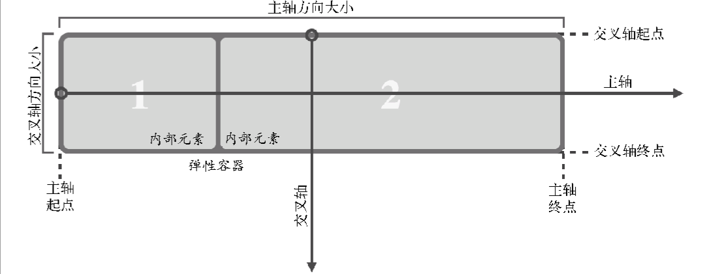

<!-- TOC -->

- [响应式设计基础](#响应式设计基础)
- [媒体查询](#媒体查询)
    - [媒体查询特性](#媒体查询特性)
    - [媒体查询注意事项](#媒体查询注意事项)
    - [视口 `meta`标签](#视口-meta标签)
    - [媒体查询4级](#媒体查询4级)
- [弹性布局与响应式图片](#弹性布局与响应式图片)
    - [将固定像素大小转换为弹性比例大小](#将固定像素大小转换为弹性比例大小)
    - [布局技术](#布局技术)
    - [Flexbox](#flexbox)
        - [垂直居中文本](#垂直居中文本)
        - [偏移](#偏移)
        - [对齐](#对齐)
        - [flex 伸缩性](#flex-伸缩性)
        - [改变原始次序](#改变原始次序)
    - [响应式图片](#响应式图片)
        - [picture 元素](#picture-元素)
- [HTML5 与响应式 Web 设计](#html5-与响应式-web-设计)
    - [宽容的 HTML5](#宽容的-html5)
    - [HTML5 新语义元素](#html5-新语义元素)
    - [HTML5 文本级元素](#html5-文本级元素)
    - [WCAG 和 WAI-ARIA](#wcag-和-wai-aria)
    - [在 HTML5 中嵌入媒体](#在-html5-中嵌入媒体)
    - [关于 "离线优先"](#关于-离线优先)
- [CSS3 新特性](#css3-新特性)
    - [CSS 响应式多列布局](#css-响应式多列布局)
    - [断字](#断字)
    - [创建水平滚动面板](#创建水平滚动面板)
    - [CSS 中创建分支](#css-中创建分支)
        - [Modernizr](#modernizr)
    - [新 CSS3 选择符](#新-css3-选择符)
    - [自定义属性和变量](#自定义属性和变量)
    - [CSS calc](#css-calc)
    - [相对视口长度](#相对视口长度)
    - [Web 排版](#web-排版)
    - [CSS3 的新颜色格式及透明度](#css3-的新颜色格式及透明度)
- [CSS3 高级技术](#css3-高级技术)
    - [文字阴影特效](#文字阴影特效)
    - [盒阴影](#盒阴影)
        - [内阴影](#内阴影)
    - [背景渐变](#背景渐变)
        - [线性渐变语法](#线性渐变语法)
        - [径向渐变背景](#径向渐变背景)
        - [重复渐变](#重复渐变)
    - [背景大小](#背景大小)
    - [背景位置](#背景位置)
    - [高分辨率背景图像](#高分辨率背景图像)
    - [CSS 滤镜](#css-滤镜)
- [SVG 与响应式 Web 设计](#svg-与响应式-web-设计)
- [CSS3 过渡、变形和动画](#css3-过渡变形和动画)
- [表单](#表单)
- [实现响应式 Web 设计](#实现响应式-web-设计)

<!-- /TOC -->
# 响应式设计基础
> 响应式 Web 设计综合运用了弹性网格布局、弹性图片/媒体、媒体查询三种技术，使得网页内容会随着访问它的视口及设备的不同而呈现不同的样式。

实现从最简单的体验开始，逐步扩充(渐进增强)。可以使用工具来完成自动化，使用 PostCSS 帮助处理浏览器前缀等。

iPhone默认会按照 980px 宽度来渲染页面，然后再把页面缩小呈现现在视口当中。浏览器用于呈现网页的区域叫视口(`viewport`)。视口通常并不等于屏幕大小，特别在可以缩放浏览器窗口的情况下。
```html
<meta name="viewport" content="width=device-width">
```
`<meta>`标签的意思是: 按照设备宽度(device-width)来渲染网页内容。

图片处理:
```css
img {max-width: 100%;}
```
声明`max-width`规则，保证所有图片最大显示为其自身的 100%,如果包含图片元素比图片固有宽度小，图片会缩放沾满最大可用空间。如果要实现图片自动缩放，也可使用`width: 100%`，那么图片就会按照width显示，不考虑自身固有宽度。容器宽时造成图片拉伸。

> 断点: 就是某个宽度临界点，跨过这个点布局就会发生显著变化。推荐不针对流行设备宽度设置断点，因为这样实际上把设计跟特定的屏幕大小绑定了。响应式设计应该跟显示它的设备无关才对，而不是只在某些屏幕中才最合适。断点应该由项目设计决定。

最小宽度媒体查询: 可以使用不同的长度单位指定:
```css
@media screen and (min-width: 50em) {
    /* 样式 */
}
```
`@media`告诉浏览器这是媒体查询。媒体查询外面写第一条规则，针对的是所有媒体的基本样式。在此基础上,在针对不同能力设备加以扩展。

> 基本上所有浏览器默认的文本大小都是 16px, 因此用像素值除以16就可以得到 rem 值。

# 媒体查询
CSS3 规范分成很多模块，媒体查询(3级)只是其中一个模块。利用媒体查询，可以根据设备的能力应用特定的 CSS 样式。除了 IE8 及以下版本，几乎所有浏览器都支持。

CSS3 媒体查询可以让我们针对特定设备能力或条件为网页应用特定 CSS 样式。媒体查询可以使用条件逻辑。

使用方法： 
1. 在`link`标签中使用媒体查询
    ```html
    <link rel="stylesheet" media="screen and (orientation: portrait)" herf="portrait-screen.css"/>
    ```
    组合媒体查询: 可以将多个媒体查询串在一起，使用逗号分给每个媒体查询表达式。注意，如果在 `projection`(投影机)之后可以没有任何特性/值对,表示适用任何投影机，这样省略特定特征，表示适用于任何特性的该媒体类型。

    > 任何长度单位都可以用来指定媒体查询条件。800像素等于50em。

    可以使用`@import`导入CSS时使用媒体查询，有条件的添加样式
    
    ```css
    @import url("phone.css") screen and (max-width:360px);
    ```

    CSS 中 `@import` 会增加 HTTP 请求(进而影响加载速度)，慎用。

2. 在 CSS 中使用媒体查询:
最常见的是在CSS内部直接使用媒体查询。

    注意： 在多数情况下，并不需要指定 `screen` 因为针对所有设备的媒体查询中， 可以使用简写语法，即省略 `all` 及其后的 `and`。如果不指定关键字，则关键字就是 `all`。除非要针对特定媒体类型应用样式，否则不要写 `screen and`

## 媒体查询特性
- width: 视口宽度
- height: 视口高度
- device-width: 渲染表面宽度(可认为是屏幕的宽度)
- device-height: 渲染表面高度(可认为是屏幕的高度)
- orientation: 设备方向是水平还是垂直
- aspect-ratio: 视口宽高比。16:9 写成 16/9
- color: 颜色组分的位深。`min-color:16`表设备至少支持16位深
- color-index: 设备颜色查找表中条目数，不能为负数
- monochrome: 单色帧缓冲中表示每个像素的位数
- resolution: 屏幕或打印分辨率
- scan: 针对电视的逐行扫描progressive和隔行扫描interlace
- grid: 设备基于栅格还是位图

除了 scan 和 grid 都可以加上min或max前缀以指定范围。
## 媒体查询注意事项
1. 使用媒体查询链接不同的 CSS 文件: 现在浏览器知道那些样式表必须立即分析，哪些样式可以等到页面初始渲染结束后再处理。不符合媒体查询条件的 CSS 文件可以延缓执行(deferred),到页面初始加载后再处理。
    > 阻塞渲染仅是指资源是否会暂停浏览器首次页面渲染，无论 CSS是否阻塞渲染，资源都会被下载，只是说非阻塞性资源优先级较低而已。
2. 分割媒体查询利弊: 多一个文件要多一个 HTTP 请求，太多 HTTP 请求影响性能。
    
    提升性能考虑流程:
    - 所有图片都压缩过了
    - 所有脚本都拼接和缩短了
    - 所有资源都采用 gzip 压缩
    - 所有静态内容都缓存到了 CDN
    - 所有多余的 CSS 规则都被清除了
3. 把媒体查询写在常规样式表中:
   
   相对于组合媒体查询，更好的是把媒体查询写在需要的地方
   ```css
   .a {width: 50%;}
   @media min-width: 30rem {.a{width: 75%;}}
   .b {width: 65%;}
   @media min-width: 30rem {.b{width: 75%;}}
   ```
   这样更利于维护 CSS 样式。也可以使用 CSS 预处理器和后处理器使用。
   > 如果希望合并所有条件相同的媒体查询，可以使用构建工具 Grunt 和 Gulp

## 视口 `meta`标签
`<meta>` 标签应该放在 `<head>`中，可以设置具体宽度或比例。

- initial-scale 指定内容放大、缩小倍数
- width=device-width 告诉浏览器页面等于设备宽度
- maximum-scale 最大放大倍数
- user-scalable=no 禁止缩放

## 媒体查询4级
1. 可编程:
   
   ```css
   @media (scripting: none) {
       /* 没有JS的样式 */
   }
   @media (scripting: enabled) {
       /* 有JS的样式 */
   }
   @media (scripting: initial-only) {
       /* JS只在一开始有效的样式，如打印，一开始用 JS 排版 */
   }
   ```
2. 指针特性: 查询鼠标之类指针设备是否存在。有三个值: none、 coarse(代表触摸屏设备中手指)和fine(鼠标，手写笔等精确指针设备)
   ```css
   @media (pointer: fine) {
       /* 针对精确指针形式 */
   }
   ```
   最保险用法假设用户使用触屏设备，并相应把界面元素放大，这样即使用户使用鼠标，也不影响体验。
3. 悬停媒体特性: 测试用户是否可以通过某种机制实现屏幕上悬停的。如有多种输入机制(触摸或鼠标)，则检查主输入机制。没有悬停能力，用 none， 悬停但必须经过一定启动步骤，使用 on-demand， 可以悬停，用 hover；
   ```css
   @media (hover: on-demand) {
       /* 针对可通过启用程序实现悬停用户样式 */
   }
   ```
4. 环境媒体特性: 根据环境改变设计。比如颜色
   ```css
   @media (light-level: normal) {
       /* 针对标准亮度的样式 */
   }
   ```
# 弹性布局与响应式图片
2015年推出 CSS 新的布局模块"弹性盒子"(Flexbox),已经有很多浏览器支持，用于实现弹性布局。

## 将固定像素大小转换为弹性比例大小
转换公式为:
```
结果 = 目标/上下文
```
用元素所在容器的大小除元素大小。例如在一个布局页面上，宽度为 960px ，左侧边栏宽度是 200px, 右侧是 100px, 中间区块为 660px, 则转换后，左栏为 `200/960 = 0.208333333`，结果为 20.8333333%，中间区域为 68.75%, 右边栏为 10.4166667%

对于小屏幕，核心思想是把内容显示在一根长条里。此时左边栏会作为"画外元素"存在，通过用于保存菜单导航之类的内容，只有当用户点击了某个菜单图标才会滑入屏幕。主内容区在页头下发，右边栏在主内容区下发，然后是页脚。

左边栏处理
```css
.Left {
    height: 625px;
    display: inline-block;
    position: absolute;
    left: -200px;
    width: 200px;
    font-size: .9rem;
    transition: transform .3s;
}
@media (min-width: 40rem) {
    .Left {
        width: 20.8333333%;
        left: 0;
        position: relative;
    }
}
```
> 注意： 尽管宽度会被浏览器转化为像素，但保留这些位数有助于将来计算精确。还有，实际项目中药考虑 JavaScript 不可用的情况。

## 布局技术
1. **行内块和空白**: 使用行内块(inline-block)布局最大问题，是它会在 HTML 元素中渲染空白。可以设置 font-size 为零去掉空白，但这个方法也有自己问题与局限性。
   
   另外，行内块中垂直居中内容也不容易。也做不到让两个相邻元素一个固定宽度，另一个填充剩余空间。
2. **浮动**: 尽管浮动布局跨平台一致性好，但仍有两个缺点:
   1. 如果给浮动元素设定宽度百分比，那么最终计算值在不同平台上的结果不一样(有的向上取整，有的向下)。
   2. 通常需要清除浮动，才能避免折叠。
3. **表格与表元**: 别把`display: table`和`display: table-cell`与对应 HTML 元素搞混。这种布局有很多实用之处: 跨平台绝对一致，而且能做到一个元素在另一个元素内垂直居中。产生的间距也恰到好处，不会像浮动那样。

    限制是需要在每个项目外包一层(想完美垂直居中，表元必须被包在表格元素中)。不能把设置为`display:table-cell`的项目包到多行上。

## Flexbox
Flexbox 可以解决其它布局显示机制的问题:
1. 方便地垂直居中内容
2. 改变元素视觉次序
3. 在盒子里自动插入空白以及对齐元素、自动对齐元素空白

> IE9 以下版本不支持Flexbox

简单案例
```css
.flex {
    display: flex;
    flex: 1;
    justify-content: space-between;
}
```
在安卓浏览器(v4及以下版本操作系统)和IE10,要写成
```css
.flex {
    display: -webkit-box;
    display: -webkit-flex;
    display: -ms-flexbox;
    display: flex;
    -webkit-box-flex: 1;
    -webkit-flex: 1;
    -ms-flex: 1;
    flex: 1;
    -webkit-box-pack: justify;
    -webkit-justify-content: space-between;
    -ms-flex-pack: justifyl
    justify-content: space-between;
}
```
-ms-是 Microsoft, -webkit-是 WebKit, -moz-是 Mozilla。自动加前缀: 使用 Autoprefixer 这个 PostCSS插件来添加前缀。

Flexbox有4个关键特性: 方向、对齐、次序和弹性。

### 垂直居中文本
```css
.Center {
    display: flex;
    align-items: center;
    justify-content: center;
}
```
`display: flex` 设置当前布局为`flex`。`align-items`设置在 Flexbox 中沿交叉轴对齐项目。`justify-content`设置内容沿主轴居中。

### 偏移
```html
<div class="MenuWrap">
    <a href="#" class="ListItem">Home</a>
    <a href="#" class="ListItem">About Us</a>
    <a href="#" class="ListItem">Products</a>
    <a href="#" class="ListItem">Policy</a>
    <a href="#" class="LastItem">Contact Us</a>
</div>
```
```css
.MenuWrap {
	font-family: 'Oswald', sans-serif;
	font-size: 1rem;
	min-height: 2.75rem;
	display: flex;
	align-items: center;
	padding: 0 1rem;
}
.ListItem {
	margin-right: 1rem;
}
.LastItem {
	margin-left: auto;
}
```

在包含元素上设置`display: flexbox;`后，其子元素都会变成弹性项(flex-item),从而在弹性布局模型下布局。`margin-left: auto`，让最后一项用上该侧所有可用的外边距。

**反序**: 给包含的 CSS 加一行 `flex-direction: row-reverse;`, 把最后一项的`margin-left: auto;`改成`margin-right: auto;`

**垂直排列**: 在包含元素中使用 `flex-direction: column`, 再把自动外边距属性去掉

**垂直反序**: 只要改成 `flex-direction: column-reverse;`就行了。

> flex-flow属性, 是 flex-direction 和 flex-wrap的合体。另外，最早的Flexbox不存在该属性，可能会失效。

**行内伸缩**: `inline-flex`作用类似于`inline-block`和`inline-table`, 会保留元素间的空白。

### 对齐
Flexbox 的对齐，最重要的是理解坐标轴。有两个轴，主轴和交叉轴，这两个轴代表什么取决于 Flexbox 排列的方向。 Flexbox 方向为 row， 主轴是横轴，交叉轴是纵轴； Flexbox 方向为 column， 主轴是纵轴，交叉轴是横轴。



1. align-items: 在交叉轴上定位元素。center表示居中。同样效果会应用给其中所有子元素。
2. align-self: 决定元素自己的对齐方式。

交叉轴的对齐align-items:
1. flex-start: 让元素从 Flexbox 元素起始边开始
2. flex-end: 沿 Flexbox 父元素的末尾对齐该元素
3. center: 放在 Flexbox 元素的中间
4. baseline: 让 Flexbox 元素中所有项沿基线对齐
5. stretch 让 Flexbox 中所有项(没交叉轴)拉伸至与父元素一样大

主轴对齐justify-content:
1. flex-start
2. flex-end
3. center
4. space-between 会在子元素之间添加相同空白
5. space-around 会在两边各添加相同空白

### flex 伸缩性
除了 width 还可通过 flex 定义宽度，叫伸缩性。flex实际上是三个属性合体的简写: flex-grow、flex-shrink和 flex-basis
```css
flex: 1(伸展) 1(收缩) 100px(基准)
```
对于伸缩项，如果flex属性存在，则它的值控制元素大小,忽略宽度和高度值的设置。
1. flew-grow 相对于其他伸缩项，当前伸缩项在空间允许情况下伸展的量。
2. flex-shrink 是空间不够情况下，当前伸缩项相对于其他伸缩项可以收缩的量。
3. flex-basis 是伸缩项伸缩的基准值。

`flex: 0 0 50px`指这个伸缩项不伸也不缩，基准为50像素；`flex: 1 2 auto` 指在有空间情况下伸展1部分，空间不足收缩1部分，基准是内容的固有宽度(即不伸缩下内容大小)

> flex-shrink 设置为0， flex-basis 实际上相当于最小宽度。

flex 属性会让内容在空间允许的情况下伸展。因此页面主体时伸缩容器，`min-height`是100%,主容器`flex: 1` 会让主容器尽可能占据所有有效空间。使得页脚驻留底部。

### 改变原始次序
在 `display: table`的容器内。想放到前头的，就切换成`display: table-caption;` 想放在底部的，切换成`display: table-footer-group`,放在开头第二位，用`display: table-header-group`

Flexbox 内置了重新排序的功能。
```css
.FlexContent {
    order: -1; // 调整为第一项
}
```
order属性可以修改次序。-1表示位于其他所有元素之前。
假如需要更改次序元素很多，建议再明确一些，为每个元素添加序列号。这样才能和媒体查询一块使用。

## 响应式图片
两个响应式图片的典型应用场景:
1. 通过 `srcset` 切换分辨率
   ```html
   
   ```
   src属性指定1倍大小图片和在不支持 `srcset` 属性的浏览器中用作后备。

   对于支持 `srcset` 属性的浏览器，通过逗号分隔图片描述，让浏览器决定用哪一个。图片描述首先是图片名，然后是分辨率说明。不过有个问题: 1440像素宽、1x屏幕的会拿到跟480像素宽、3x屏幕相同的图片。
2. `srcset` 以及 `sizes` 联合切换
   在响应式设计中，经常可以看到小屏幕中全屏显示，大屏幕只显示一般宽的图片。
   ```html
   
   ```
   w意思是告诉浏览器图片多宽，大致等于图片 "CSS像素" 大小。使用w后缀的值对引入sizes属性非常重要。通过sizes把意图传达给浏览器。

   > vw: 视口宽度的 1%; vh: 视口高度的 1%;

   `sizes` 属性第一个值告诉浏览器在最小宽度为 17em 的设备中，图片显示宽度约为 100vw。
   `sizes` 属性的第二个值，其实是让浏览器如果设备宽度大于等于 40em，只让图片显示为50vw宽。用DPI来解释就明白了。如果设备宽度320px，而分辨率 2x(实际宽度是640px)，那浏览器可能会选择900px宽图片，因为对当前屏幕宽度而言，它时第一个符合要求的足够大的图片。

   `sizes` 仅仅是给浏览器提示，并不保证浏览器言听计从。如果不想让浏览器决定，可以使用 picture 元素
### picture 元素
为不同视口提供不同图片。
```html
<picture>
    <source media="(min-width: 30em)" srcset="cake-table.jpg">
    <source media="(min-width: 60em)" srcset="cake-shop.jpg">
    
</picture>
```
picture元素只是一个容器，为我们其中img元素指定图片提供便利。如果添加样式，应该是内部的 img元素。 `srcset` 属性用途与前面一样。 这里的 img标签是浏览器不支持 picture元素，或支持picture但没有合适媒体定义时的后背，不能省略。

这里不同的是 source 标签，标签里使用媒体查询表达式告诉浏览器在什么条件下使用什么图片。

picture还支持提供可替换的图片格式，比如 webp格式图片。其 type 属性通常用于指定视频来源。

# HTML5 与响应式 Web 设计
> 腻子脚本: 用于给老版本浏览器支持新特性。不过腻子脚本也会导致网站臃肿。

```html
<!DOCTYPE html>
```
doctype告诉浏览器文档类型
```html
<meta charset="utf-8"> 
```
指定编码集

## 宽容的 HTML5
HTML5 可以没有结束反斜杠，属性值可以没有引号，也可以没有 type 声明。省略 `<head>` 标签也没有问题。

HTML5 的一大好处是可以把多个元素放到一个 `<a>` 标签里。唯一限制是不能把另外一个`<a>`标签或 `button` 之类的交互性元素元素放到同一个 `<a>` 标签里，也不能放入表单。

## HTML5 新语义元素
> 语义: 含义在语言或逻辑方面的分支

语义就是赋予标记含义。
- `<main>元素`: 声明主内容区,每个页面的主内容区只能有一个。
- `<section>元素`: 定义文档或应用中一个通用区块。是否使用? 判断其中内容是否配有自然标题(如`h1`)，如果没有，最好还是选`div`。
  - 使用场合：文章的章节、标签对话框中的标签页、或者论文中有编号的部分。
- `<nav>元素` 用于包装指向其他页面或同一页面中不同部分的主导航链接。可以把之前`ul`和`li`写的导航改用`nav`和`a`标签。
- `<article>元素`: 用于包含一个独立的内容块。对于嵌套的`article`而言，内部的应该与外部的`article`关联。一般来说，article会有标题部分( 包含在header内 )，有时也会包含footer。
  - 使用场合：一段内容脱离了所在的语境，仍是完整的、独立的，则应该用article标签。
- `<aside>元素`: 用于包含与其旁边内容不相关的内容。常用于包装侧边栏、突出引用、广告和导航元素。基本上和主内容无关的都可以放到里面
- `<figure>和<figcaption>元素`: 适用于包装图片和代码，使用`figcaption`提供标题。
- `<detail>和<summary>元素`: 展开/收起部件,默认只显示摘要文本(`summary`里的文本),给 `details` 元素添加 open 属性,则默认打开面板。
    禁用黑色小三角图标:
    ```css
    summary::-webkit-details-marker {
        display: none;
    }
    ```
- `<header>元素`: 用在站点页头或在 article 元素中做某个区块的引介区。
- `<footer>元素`: 用于在相应区块中包含与区块相关内容。与 header 一样可出现多次
- `<address>元素`: 用于标记联系人信息
- `h1和h6`: 不能用于标记副标题、字幕、广告语除非想把它们作为新区块或子区块标题。

```html
<body>
	<h1>Ben's site</h1>
	<section>
		<h1>Ben's blog</h1>
		<p>All about what I do</p>
	</section>
	<article>
		<header>
			<h1>A post about something</h1>
			<p>Trust me this is a great read</p>
			<p>No, not really</p>
			<p>See. Told you.</p>
		</header>
	</article>
</body>
```

## HTML5 文本级元素
- `<b>元素`: 加粗文本，只为引人注意而标记的文本。可在 CSS 的 `font-weight` 重置
- `<em>元素`: 表示内容中需要强调的部分。可用于给文本添加样式
- `<i>元素`: 把文本标为斜体，可用它在文本中标记出罕用的名字

## WCAG 和 WAI-ARIA
> WCAG的宗旨是: 提供一份能满足个人、组织和政府间国际交流需求的 Web 内容无障碍的标准。

> WAI-ARIA 目标是总体上解决网页动态内容的无障碍问题。

WAI-ARIA 致力于解决这些问题:
- 不要对语义元素使用角色: `role`属性

多数情况下，设置ARIA默认暗含的语义匹配的ARIA角色或aria-*属性是不必要的，也是不推荐的，因为浏览器已经设置了这些属性。

注意: 方便辅助技术最简单的方式时尽可能使用正确的元素。

## 在 HTML5 中嵌入媒体
IE8及更低版本的IE不支持 HTML5 视频和音频。

在 HTML5 中只要一对 `<video></video>`(或`<audio></audio>`标签)就行。可以在标签中添加文本，让用户知道这是什么。还可设置 width 和 height

- 使用默认播放控件，添加 controls 属性;
- 使用 autoplay 属性，自动播放
- preload属性用于控制媒体预加载
- loop属性 循环播放
- poster属性 设置视频首屏图像
- `<source>`标签在旧版本浏览器中提供后背资源
```html
<video width="640" height="480" controls preload="auto" loop poster="myVideoPoster.png">
    <source src="myVideo.mp4" type="video/mp4"> 
    <object width="640" height="480" type="application/x-shockwave-flash" data="myFlashVideo.SWF">
        <param name="movie" value="myFlashVideo.swf" />
        <param name="flashvars" value="controlbar=over&amp;image=myVideoPoster.jpg&amp;file=myVideo.mp4" />
        
    </object>
    <p><b>Download Video:</b>
    MP4 Format:  <a href="myVideo.mp4">"MP4"</a>
    </p>
</video>
```
audio标签和 video标签 属性相同(不包括 width、height和poster)，主要区别是音频没有视频需要的播放区域。

目前视频唯一的问题是它不是响应式的。让 HTML5 视频变成响应式: 删除高度和宽度属性，并添加 CSS:
```css
video {max-width: 100%; height: auto;}
```
这种方式不能解决内嵌框架中的嵌入视频
```html
<iframe width="960" height="720" src="https://www.youtube.com/watch?v=B1_N28D3gY" frameborder="0" allowfullscreen></iframe>
```
方法是创建一个比例相同的盒子来包含视频。打开 http://embedresponsively.com/, 把内嵌框架的URL粘贴进去。得到对应代码

## 关于 "离线优先"
创建响应式网页及页面应用理想方式是 离线优先， 就是保证网站和应用始终可以打开，即使不上网也能加载内容。

# CSS3 新特性
CSS 规则
```css
.round { /* 选择符 */
   border-radius: 10px; /* 声明 */
}
```

## CSS 响应式多列布局
- column-width 给每一列设定列宽，比如 `12em`。改变视口会动态改变列数
- column-count 固定列数，宽度可变
- column-gap 添加列间距，比如 `2em`
- column-rule 添加分割线，比如 `thin dotted #999;`

## 断字
- `word-wrap: break-word` 使得容器包含字体，支持IE5.5
- 截断文本，用`...`替换多余的文本
    ```css
    .truncate {
        width: 520px;
        overflow: hidden;
        text-overflow: ellipsis;
        white-space: nowrap;
        /* 声明确保长出来的文本不会折行显示在外部元素中 */
    }
    ```

## 创建水平滚动面板
```css
.Scroll_Wrapper {
    width: 100%;
    white-space: nowrap;
    overflow-x: auto;
    overflow-y: hidden;
    /* 在 Webkit 触摸设备上出现 */
    -webkit-overflow-scrolling: touch;
    /* 在支持的IE中删除滚动条 */
    -ms-overflow-style: none;
}
.Item {
    display: inline-flex;
}
/* 防止 WebKit 浏览器中出现滚动条 */
.Scroll_Wrapper::-webkit-scrollbar {
    display: none;
}
```
`white-space`空白不折行。`inline-flex`把元素转换为行内元素。

## CSS 中创建分支
创建分支可以基于CSS，支持浏览器不多；借助 JavaScript库，获得广泛兼容性。
```css
.Item {
    display: inline-block;
}
@supports (display: flex) {
    .Item {
        display: inline-flex;
    }
}
```
`@supports` 支持 and、 or 关键字,并非所有浏览器都支持`@supports`

### Modernizr
利用 Modernizr 这个 JavaScript 工具。是实现分支的可靠方式。

> 渐进增强，就是从最简单的可用代码开始，从最基本的功能开始，从支持能力最低的设备开始，逐步增强到支持能力更强的设备

在头部添加文件
```html
<script src="/js/libs/modernizr-2.8.3-custom.min.js"></script>
```
Modernizr 在检测完浏览器特性后，会给 html 标签添加检查到的类，比如
```html
<html class="js no-touch cssanimations csstransforms" lang="en"></html>
```
之后就可以根据这些类编写 css 分支

## 新 CSS3 选择符
- 属性选择符 `img[alt] {}`
  - 可以结合字符串匹配
    - `img[alt^="film"]` 以...开头
    - `img[alt*="film"]` 包含...
    - `img[alt$="film"]` 以...结尾
  - 属性都被当成一个字符串
- 结构化伪类: 基于元素之间位置关系选择它们
  - :last-child 选择最后一项
  - :only-child 唯一一个当前标签的选择符
  - :only-of-type 选择任意链接
  - nth规则
    - nth-child(n)
    - nth-last-child(n) 从另外一头开始
    - nth-of-type(n) 区分类型
    - nth-last-of-type(n)
    - n可以是 odd 和 even，可以是数值，还可以是表达式
  - :not 取反
  - :empty 获取没有内容的标签，注意空格也属于内容一部分。
  - :first-line 获取第一行

## 自定义属性和变量
自定义属性可以存储信息。
```css
:root {
    --MainFont: 'Helvetica Neue', Helvetica, Arial;
}
```
使用`:root` 把自定义属性保存在文档根元素上。之后引用自定义属性用`var()`
```css
.Title {
    font-family: var(--MainFont);
}
```

## CSS calc
用于计算，可以计算加减乘除 `calc(50% - 10px)`

## 相对视口长度
- vw: 视口宽度
- vh: 视口高度
- vmin: 视口中的最小值，等于 vw 或 vh 中较小的值
- vmax: 视口中的最大值，等于 vm 或 vh 中较大的值

## Web 排版
通过 `@font-face`实现 Web 字体,可以使用相对视口的单位设置字体。使用`@font-face` 唯一需要注意的问题是文件大小。

## CSS3 的新颜色格式及透明度
- RGB
- HSL(色相、饱和度、亮度)
- alpha 通道

# CSS3 高级技术
## 文字阴影特效
```css
.element {
    text-shadow: 1px 1px 1px #ccc;
}
```
缩写值规则先右后下，顺时针顺序。第一个值为右侧偏移量，第二个值为阴影下方偏移量，第三个值为模糊量，最后一个色值。可以省略第三个值(blur值)。
多文字阴影:
```css
.text {
    text-shadow: 3px 3px #bbb,/* 右下 */
        -3px -3px #999; /* 左上 */
}
```
## 盒阴影
遵循和文字阴影相同的语法: 水平偏移量， 垂直偏移量， 模糊距离， 阴影尺寸，及阴影颜色。前两个长度值必须存在。可添加多重阴影，用逗号分隔，按照底部到顶部的顺序添加。

阴影尺寸可以按照设置在所有方向上缩放阴影。
### 内阴影
```css
.inset {
    box-shadow: inset 0 0 40px #000;
}
```

## 背景渐变
### 线性渐变语法
创建一个从红色渐变到蓝色的渐变背景
```css
.linear-gradient {
    background: linear-gradient(red, blue);
}
```
确定渐变的方向
- `background: linear-gradient(to top right, red, blue` 默认从顶部到底部，这里设置为从底部左侧到顶部右侧
- `background: linear-gradient(45deg, red, blue)`指定角度
- `background: linear-gradient(red -50%, blue);`在容器内部不可见的地方开始渲染

色标: 用逗号进行分隔。第一部分是颜色，第二部分是颜色的位置。
```css
background: linear-gradient(#f90 0, #f90 2%, #eee 50%, #f90 98%, #f90 100%);
```

兼容旧式浏览器
```css
.thing {
    background: red;
    background: linear-gradient(45deg, red, blue);
}
```
### 径向渐变背景
效果一般从一个中心发散成为圆形或者椭圆形。
```css
background: radial-gradient(12rem circle at bottom, yellow, orange, red);
``` 
默认为圆形，直径默认是容器最长边。设置为`circle`会沾满整个容器，设置`40px 30px` 会生成一个椭圆形，设置`ellipse` 会生成和容器大小一致的椭圆形。

渐变位置: `at top right` 渐变中心在右上方，`at right 100px top 20px` 表示中心距右边框 100px 上边框20px处，`at center left` 中心在左边框中间处。

为响应式新增关键词
```css
background: radial-gradient(closet-side circle at center, #333, blue);
```
- `closest-side` 渐变形状会与距离中心相近边框相切
- `closest-corner` 渐变形状会与距离中心最近的角相切
- `farthest-side` 和`closest-side`相反
- `farthest-corner`
- `cover` 等价于 `farthest-corner`
- `contain` 等价于 `closest-side`

可以给标签添加多个径向渐变制作图案
### 重复渐变
```css
.repeating-radial-gradient {
    background: repeating-radial-gradient(black 0px, orange 5px, red 10px);
}
```

## 背景大小
```css
background-size: 100% 50%, 300px 400px,auto;
```
设置每张图片大小，第一个是宽度，第二个是高度，用逗号分隔。关键词
- auto: 让图片保持其原生大小
- cover: 保持图片比例，拓展至覆盖整个元素
- contain: 保持图片比例，拓展图片让其最长边保持在元素内部

## 背景位置
背景位置默认为左上角。
```css
background-position: top 50px right 80px, 40px 40px, top center;
```
给三个背景图片设置位置。

## 高分辨率背景图像
媒体查询让我们可以在不同的视口大小下加载不同分辨率的图像。
```css
.bg {
    background-image: url('bg.jpg');
}
@media(min-resolution: 1.5dppx) {
    .bg {
        background-image: url('bg@1_5x.jpg');
    }
}
```
媒体查询包括长度、高度或者其他支持的弧形。

## CSS 滤镜
```css
.filter-drop-shadow {
    filter: drop-shadow(8px 8px 6px #333);
}
```
drop-shadow 语法与 box-shadow 类似

可用的滤镜:
- `filter: blur(3px)` 使用简单长度值，模糊效果
- `filter: brightness(2)` 加亮
- `filter: contrast(2)` 对比度
- `filter: drop-shadow(4px 4px 6px #333)`
- `filter: grayscale(.8)` 灰度化
- `filter: hue-rotate(25deg)` 色轮变化
- `filter: invert(75%)` 反色程度
- `filter: opacity(50%)` 透明度
- `filter: saturate(15%)` 饱和度
- `filter: sepia(.74)` 添加褐色滤镜

多个滤镜用空格分隔。慎重使用滤镜效果，有时滤镜渲染会有很大开销。

# SVG 与响应式 Web 设计
# CSS3 过渡、变形和动画
# 表单
# 实现响应式 Web 设计
